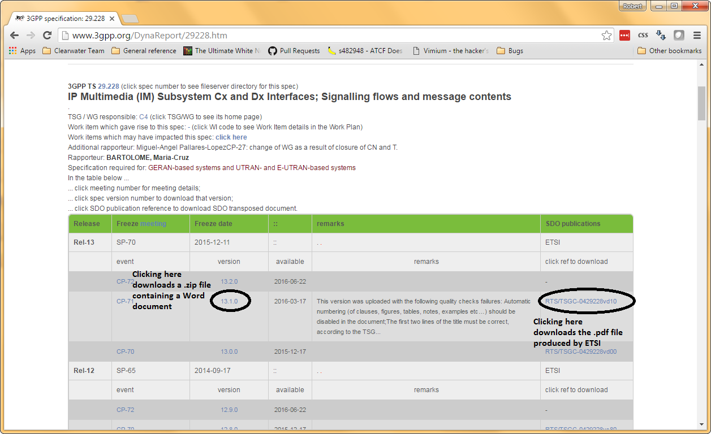

Getting to grips with the 3GPP IMS specs
----------------------------------------
One of the principles behind Project Clearwater is that – although we use a novel, cloud-native architecture – we are a spec-compliant IMS core. This means that we don’t just implement features because they seem like a good idea, or because they’re fun to write (although both these things are generally true!) – we implement the IMS behaviour defined by the 3GPP Technical Specifications. This gives us standard, predictable interfaces, and means that we can connect to any other IMS components (a HSS, application servers, interconnect devices like an IBCF, access devices like an AGCF…) and, as long as they also implement the IMS specs correctly, it’ll just work. This means, though, that in order to understand Clearwater, you need to understand the IMS specs – for example, these define what a “I-CSCF” is and does, and they define when and in what situations we should add particular SIP headers and Diameter AVPs to messages. Without understanding what the 3GPP specifications require, it’s impossible to tell whether what Clearwater’s doing is a bug or whether it’s actually required behaviour. Since these specs are so important to understanding Clearwater, we’ve decided to talk a bit about how to find your way around them – in particular, how to find the ones that matter to Clearwater, and filter out the ones that don’t (such as ones talking about Ro billing, or the radio access network).

## How are the specs structured?

[http://www.3gpp.org/specifications/specification-numbering](http://www.3gpp.org/specifications/specification-numbering) talks about how the 3GPP Technical Specifications (usually abbreviated “TS”) are structured – of the categories listed there, the groups most interesting to us are:

*   “Technical realization” (the 23 series) – which covers the high-level architecture of IMS and the broader System Architecture Evolution of 4G
*   “Signalling protocols” (the 24, 28 and 29 series) – which cover how to actually implement the architecture from the 23 series – for example, how an I-CSCF should act on specific SIP headers
*   “OAM&P and Charging” (the 32 series) – which cover the operational aspects of a telecoms network, like statistics and billing

Not everything in each of these series is relevant to Clearwater, though – for example, TS 23.031 is about 3G security and fraud prevention, which we don’t need to implement in Clearwater as we don’t use the 3G (GSM/CDMA) protocols. 3GPP specs are versioned – for example, a spec might have the version number 10.8.0\. This means it is IMS release 10, and the eighth update of this spec within the release. Documents include a change history at the end to help determine what’s changed – for example, in the spec TS 29.228, the change between 10.7.0 and 10.8.0 was “Cancellation of the old S-CSCF for IMS Subscription and IMS Restoration Procedures”. Here’s how to download the right documents from the 3GPP website:

## Relationship to other specs

A lot of 3GPP specs are also published by ETSI – for example, 3GPP TS 32.409 is ETSI TS 132 409\. The text is the same, but the ETSI specs are in PDF format rather than Microsoft Word format, which may be more convenient. Some information from 3GPP specs is also republished in different form as an IETF RFC. For example, RFC 3455 is “Private Header (P-Header) Extensions to the Session Initiation Protocol (SIP) for the 3rd-Generation Partnership Project (3GPP)” and covers things like P-Visited-Network-ID. These documents are produced as part of 3GPP efforts to collaborate with the IETF, but they often lag behind the 3GPP-produced specs, so it’s best to treat the 3GPP documents as definitive when working with Clearwater and prefer them to the RFCs.

## Overall architecture

TS 23.002 is the “Network architecture” document, covering not just IMS but a whole mobile/3GPP network. This defines what the individual elements in an IMS network are, and what they do – for example, section 4a7.1 defines the Call Session Control Function (CSCF), and gives specific responsibilities like “the I CSCF is mainly the contact point within an operator's network for all IMS connections destined to a subscriber of that network operator, or a roaming subscriber currently located within that network operator's service area”. This also contains the list of IMS reference points (e.g. what the Gm or Rf interfaces are). TS 23.228 goes into more detail on the IMS part of the network specifically – for example, it devotes a whole section to what the I-CSCF does, compared to just a sentence in TS 23.002.

## Subscriber data

TS 23.003 is the spec on “Numbering, addressing and identification”, and section 13 covers the IMS core. This introduces and defines high-level subscriber related concepts like Private User Identity and Public User Identity – for example, this is the spec that says a Public User Identity must be a SIP URI or a Tel URI. TS 23.008 covers “Organization of subscriber data”. Whereas 23.003 covers what a piece of data is, 23.008 covers its lifetime and location – for example, this says that public user identities “are permanent subscriber data and are stored in HSS, S-CSCF and BSF”.

## SIP protocol flows

TS 24.229 defines the IMS SIP flows in detail (e.g. which SIP headers get added at which points). It’s grouped by IMS function – the most useful sections for Clearwater are 5.2, 5.3 and 5.4 (Procedures at the P-CSCF, I-CSCF and S-CSCF, respectively). These are then subdivided further (for example, section 5.3 talks separately about I-CSCF processing of REGISTERs, initial requests and “subsequent requests”, i.e. in-dialog requests).

## HSS protocol flows

TS 29.228 is a high-ish level document about the semantics of the Cx interface – it defines the type of requests a HSS can receive, and the logic it should follow when it receives one. For example, it talks about a “S-CSCF registration/deregistration notification request”, gives a sequence of things for the HSS to do (such as checking that the public identity is configured in the HSS), and defines the errors (e.g. `DIAMETER_ERROR_USER_UNKNOWN`) which the HSS should return if any of these steps fail. TS 29.229 is at a lower, protocol-specific level – it defines the Diameter messages and AVPs that get sent over the wire – for example, this is the doc that defines Visited-Network-Identifier AVP as being of the OctetString type. TS 29.328 and TS 29.329 describe the Sh interface between application servers and the HSS, with the same kind of separation between them - TS 29.328 describes the high-level semantics and TS 29.329 describes the protocol details.

## Billing protocol flows

TS 32.240 is the charging architecture document – this sets out things like the difference between online/Ro and offline/Rf billing, and the components involved in Rf biiling. TS 32.299 defines the Rf and Ro Diameter applications – see [https://en.wikipedia.org/wiki/Diameter\_(protocol)#Applications](https://en.wikipedia.org/wiki/Diameter_(protocol)#Applications) for more detail on what a Diameter application is, but in simple terms, it defines the Rf messages that Clearwater’s Ralf component has to send.

## Statistics

TS 32.409 defines a set of performance measurements for IMS, and how to measure them (for example, it has a paragraph describing exactly what failure conditions cause the “Failed de-registration procedures initiated by HSS” metric to be incremented). The idea of this is to have a set of standard measurements, which is “intended to result in comparability of measurement data produced in a multi-vendor network”.
