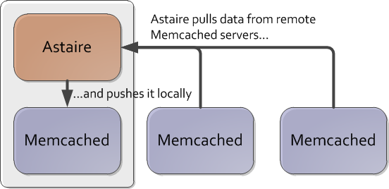

Faster Elasticity with Astaire
------------------------------
Clearwater has been built from the ground up to run in the cloud, and to take advantage of its benefits. One benefit of running in a cloud is elasticity - it is easy to assign more VMs to a particular service to respond to an increase in traffic, and later to remove these VMs when the traffic drops. Obviously, the software itself must support elastic scaling so as to do this seamlessly without disrupting the existing traffic. Clearwater has supported elastic scaling since our Pulp Fiction release in September 2013\. However, until recently an "acceptance phase" was required after scaling up or down, during which it was not possible to start another scaling operation (or at least doing so would risk losing subscriber registrations). This acceptance phase was required because Clearwater didn't proactively move data it had stored in [memcached](http://memcached.org/) servers. Instead, it just moved data on refresh (e.g. on subscriber re-registration) - reading from the old set of servers and writing back to the new set of servers. After all subscribers had re-registered, all data has been written to the new servers and acceptance phase can end. The registration expiry period is configurable and this defines how frequently subscribers must re-register, and hence the length of the acceptance phase. The default expiry period is 5 minutes, but there are deployments with expiry periods of multiple days and, since it wasn't possible to start a new scaling operation within the acceptance phase, these couldn't respond to rapid changes in load. So, in our Anna Karenina release, we introduced "[Astaire](https://github.com/Metaswitch/astaire/)", which proactively moves data between memcached servers. Astaire runs on Sprout, Memento and Ralf nodes (i.e. all Clearwater nodes that use memcached). It is a daemon and runs constantly in the background, but only performs work when triggered by "service astaire reload". When this happens, it reads the old and new topology from the [/etc/clearwater/cluster\_settings](http://clearwater.readthedocs.org/en/latest/Manual_Install/index.html#larger-scale-deployments) file (just as Sprout and Ralf do) and determines which memcached servers have data that should now live locally. It then pulls data from them and pushes it to the local memcached server.

The progress of the scale up is exposed over SNMP (both as an [alarm](http://clearwater.readthedocs.org/en/latest/SNMP_Alarms/) and as [statistics](http://clearwater.readthedocs.org/en/latest/Clearwater_SNMP_Statistics/)) and it's also possible to wait for completion using "service astaire wait-sync". Clearwater's [Chef recipes](http://clearwater.readthedocs.org/en/latest/Automated_Install/) have been enhanced to use Astaire during scale up/down, and the [elastic scaling process documentation](http://clearwater.readthedocs.org/en/latest/Clearwater_Elastic_Scaling/) for both manual and automated installations has been updated. And, to answer the question I'm sure you've been wondering: "why is it called Astaire?" The interface that the memcached server exposes for bulk retrieval is called [Tap](https://code.google.com/p/memcached/wiki/Tap) and [Fred Astaire](http://en.wikipedia.org/wiki/Fred_Astaire) was a famous tap dancer. Compared to some of our names, that's pretty straight-forward!
