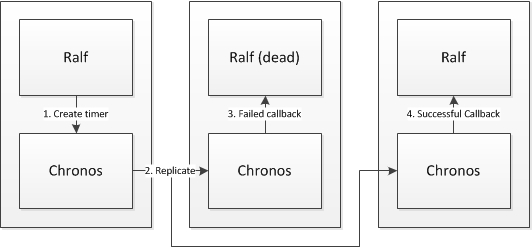

Introducing Chronos - a horizontally scalable, redundant, timer service for the cloud
---------------------------------------------------------------------------------------

As we've discussed previously, the team has spent much of the last few months working on our Rf billing solution, Ralf. The specification for the IMS Rf interface that Ralf exposes requires that Ralf generates messages regularly to indicate that a billable call is still active. In some cases these events can be triggered off SIP messages sent by the clients in the call, but, if the clients are not being very active, Ralf also needs to trigger them off a recurring timer.

When designing Ralf, we looked at existing, open source, timer systems, and we couldn't find any that didn't force each timer to be hosted on a specific node. This would not fit with Project Clearwater's high-availability model, since, if that specific node dies, the periodic messages it was timing would not be correctly generated - in other words we'd have a single point of failure in the system. Having failed to find any publicly available solutions, we decided to solve the problem ourselves.

While investigating this problem and possible solutions, we realized were in fact looking at a sub-problem of the larger problem of reliably handling long-standing time-triggered events in a horizontally scalable, redundant manner. We thus decided to implement our solution as a generic clustered timer service, Chronos.

As with all the parts of Project Clearwater, Chronos has been designed for deployment in a cloud infrastructure, supporting an `N+M` redundancy model, with dynamic addition or removal of Chronos nodes to allow for elastic resizing of the service.

### How it works

Chronos works by having each timer owned by a prioritized list of nodes in the cluster (replicas). Each replica will attempt to trigger the timer's callback when the timer pops giving redundancy to the timer. To prevent unnecessary double-popping, each replica delays its callback by a small (fixed) amount to give the previous replicas time to handle the callback first. The backup will only fire its timer if it doesn't hear a notification from the primary that the primary was successful.

To handle dynamic scaling of the cluster we've developed a nifty [bloom-filter](http://en.wikipedia.org/wiki/Bloom_filter)-based algorithm that allows the proxy layer to reliably update or delete timers in the cluster despite the cluster growing or shrinking.

To make stronger guarantees about the redundancy, we co-locate Chronos with its client service and configure timers such that Chronos will call back to `localhost`, which means each Chronos will make the callback to a different client node. This way, if one client node fails, the timer pop will still be delivered to another one.

_If you're interested in the nitty-gritty details, we've written up a [technical fly-over](https://github.com/Metaswitch/chronos/blob/master/doc/technical.md) discussing the specific issues we had to resolve and Chronos's solutions to each of them._

### Where it's used

Since we wrote Chronos as a separate component, we've been able to take advantage of it to solve another timer-related problem, this time in Sprout. Sprout uses Chronos to track registration expiry so it can send NOTIFYs on registration expiry and also uses it to age out the nonces we use for authentication to improve the security of the system by preventing replay attacks.

### More information

We've released Chronos under the GPLv3 license as part of [Project Clearwater](http://www.projectclearwater.org), and you can find more information, including the API definition and configuration instructions at [http://github.com/Metaswitch/chronos.git](http://github.com/Metaswitch/chronos.git).
