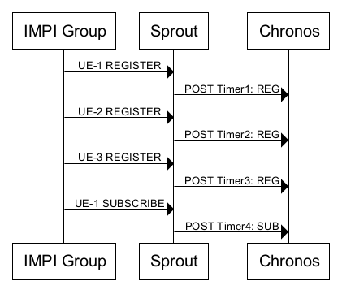
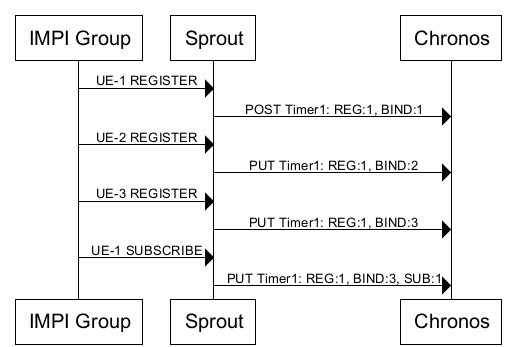

Chronos API Changes
-------------------
Chronos is the redundant timer component created and used by Project Clearwater. In the past [we have discussed](Stateful_Statistics.md) the use of Chronos in providing stateful statistics in an otherwise stateless system. Recent work has updated the structure of the RESTful API Chronos exposes to enhance the possibilities for what a timer might represent. As discussed previously, the fact that Chronos timers live for just as long as the objects they are associated with means that we can use the timer to represent that object when it comes to statistics. However, the old statistics section of the timer was limited in what it could represent. The old structure was as follows:

    “statistics”:  {
      “tags”:  [“TAG1”, “TAG2”, “TAG3”]
    }

  So while a timer could be used to represent a number of different concepts at once, it could not represent multiples of those concepts. The new structure allows the client to specify a number associated with a tag:

    “statistics”:  {
      “tag-counts”:  [
           {“tag-type”: “TAG1”, “count”: 1},
           {“tag-type”: “TAG2”, “count”: 3},
           {“tag-type”: “TAG3”, “count”: 5}
      ]
    }

  This means that we can represent more complex objects with a single timer.

#### Advantages in use

These changes have not simply been aimed at improving the conceptualisation allowed by the Chronos API; we have already put it into use and updated how Sprout sets timers. One problem that the old format left us was that we couldn’t easily distinguish between the number of registrations and the number of bindings. The diagram below shows how timers were set previous to these changes:

Despite all of the separate registered UEs belonging to the same implicit registration set, to ensure that we [actively expired bindings and subscriptions,](Expiring_Subscriptions.md) a timer was set for each member of a registration. The timers were set to expire at the expiry time of each respective binding or subscription, and were tagged as either REG or SUB, so that some statistics could be drawn. With no separate timer for the set as a whole, we could not tell how many bindings were currently active in each registration. The new design, however, enables us to set a single timer for the entire registration, with a statistics body built using the new API representing the whole set, rather than just the bindings and subscriptions in it. The new model is as below:

These timers can then be set to pop when the first member of the registration expires, triggering sprout to begin updating the whole registration. This will remove any expired members, send any necessary SIP messages, and on returning the record to our underlying data store, re-set an updated timer to pop when the next expiry is due. Not only does this render timers a better representation of the registration as a whole, but it also means that fewer timers are needed in a deployment to maintain the same level of functionality while improving our statistics.
