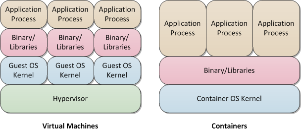

Clearwater on Docker
--------------------
Clearwater was designed from the ground up to run in the cloud. Traditionally, this has meant running under virtualization. However, more recently, there has been a lot of excitement around [containers](http://en.wikipedia.org/wiki/Operating-system-level_virtualization).

*   Virtual machines run on top a hypervisor such as [VMware ESXi](http://www.vmware.com/products/esxi-and-esx/overview) or [KVM](http://www.linux-kvm.org/page/Main_Page), which isolates each virtual machine from the others. The hypervisor makes each virtual machine think its running on bare metal, and so the virtual machine runs a full OS, including the kernel.
*   Containers take advantage of Linux kernel function to isolate them from each other. As a result, the container doesn't need to include the kernel - it just has to include the user-space components that run on top of it.

In other words, containers are much more lightweight than virtual machines, and this means that

*   the overheads are lower, so you can run more smaller servers rather than one big one - for example, you could turn up a dedicated server for each customer, rather than having one server that serves multiple customers
*   containers take much less time to spin up than virtual machines, so they could respond to changes in load more quickly, e.g. for elastic scaling.

The most widely-used container platform is [Docker](https://www.docker.com/). Over the last few weeks, we've been getting Clearwater up and running under Docker, and it's generally been pretty straight-forward. You can see the Dockerfiles in our [clearwater-docker repo](https://github.com/Metaswitch/clearwater-docker) - these allow you spin up each of the Clearwater node types. As well as spinning up individual nodes, we have also used the Docker [Compose](https://docs.docker.com/compose/) tool, which allows you to define a deployment consisting of multiple nodes with links between them. You can then spin up that whole deployment, including its links, with a single command. Unfortunately, the infrastructure we're currently using doesn't necessarily scale to clusters of multiple nodes. [Apache Mesos](http://mesos.apache.org/) (a distributed Docker platform) includes [etcd](https://github.com/coreos/etcd) for service discovery (i.e. locating neighbouring nodes), and this might provide a clustering solution - we're still investigating! Having said all that, it's still early days for using containers for VNFs such as Clearwater, and they're not fully proven for this application. In particular, it's not yet clear whether you can get the quality of service guarantees that you expect in a telecoms environment. Containers are definitely an exciting technology, though, and it's great that Clearwater's architecture adapts so well to them!
