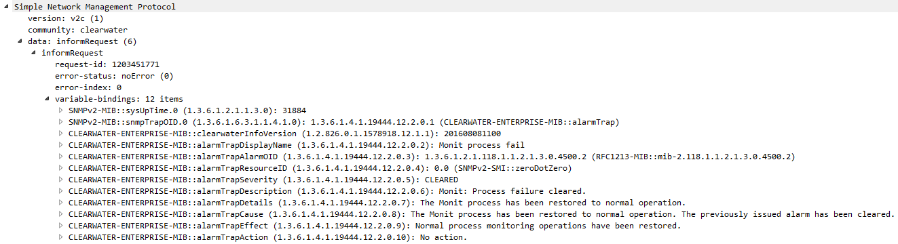

Enterprise MIB Alarms
---------------------
We've recently done some work to extend Clearwater's alarm support, adding "enterprise MIB" alarms which let us send alarms with fields specifically tailored to Clearwater's needs.

In this blog I’m going to talk about how the two ways of receiving alarms (the new enterprise MIB style and the RFC 3877 style) differ, and what a Network Management System (NMS) needs to do in order to understand these alarms. If you're not familiar with SNMP in general, a great place to start is Daniel Fusch's blog - he's done a lot of work on Java's SNMP implementation and knows the protocol well. He has a post on ["Simple is not Easy"](https://blogs.oracle.com/jmxetc/entry/simple_is_not_easy), and a four-part "Hitchhiker's Guide to SNMP" series (covering [the global OID tree](https://blogs.oracle.com/jmxetc/entry/life_the_universe_and_everything), [MIB files](https://blogs.oracle.com/jmxetc/entry/understanding_the_structure_of_management), [traps](https://blogs.oracle.com/jmxetc/entry/don_t_fell_in_the), and [tables](https://blogs.oracle.com/jmxetc/entry/welcome_to_the_snmp_table!)).

## RFC 3877 alarms

RFC 3877 defines a generic alarm MIB. In principle, if these kinds of open standard are widely adopted, they make interoperability between devices a lot simpler - anything that understands the RFC 3877 structure of SNMP messages and tables can accurately interpret alarms from any RFC 3877-compliant device (including details like probable cause, severity, and some descriptive text). Apart from the RFC 3877 ALARM-MIB, no vendor-specific MIBs are needed - SNMP devices just add rows to the alarmModelTable, which has a well-defined structure, with information about alarms that they can raise, and raise alarms that point into that table. This reduces the cost of custom integration and testing when bringing new devices into the network, and makes the ideal IMS and NFV use-cases possible - things like getting a new application server, attaching it to your network, and quickly experimenting with a new revenue-generating service. We've [previously](SNMP_Alarm_Agent.md) talked about the full structure of RFC 3877 (including the various alarm tables, and how we implement this in Clearwater), so I'm going to focus here on just decoding the SNMP Inform requests that get sent, and what each element of them means. An RFC 3877 alarm, when viewed in tshark, looks like this:

    Simple Network Management Protocol
     version: v2c (1)
     community: clearwater
     data: informRequest (6)
      informRequest
       request-id: 763216082
       error-status: noError (0)
       error-index: 0
       variable-bindings: 4 items
        1.3.6.1.2.1.1.3.0: 9822667
         Object Name: 1.3.6.1.2.1.1.3.0 (iso.3.6.1.2.1.1.3.0)
         Value (Timeticks): 9822667
        1.3.6.1.6.3.1.1.4.1.0: 1.3.6.1.2.1.118.0.3 (iso.3.6.1.2.1.118.0.3)
         Object Name: 1.3.6.1.6.3.1.1.4.1.0 (iso.3.6.1.6.3.1.1.4.1.0)
         Value (OID): 1.3.6.1.2.1.118.0.3 (iso.3.6.1.2.1.118.0.3)
        1.3.6.1.2.1.118.1.2.2.1.13.0: 1.3.6.1.2.1.118.1.1.2.1.3.0.2000.1 (iso.3.6.1.2.1.118.1.1.2.1.3.0.2000.1)
         Object Name: 1.3.6.1.2.1.118.1.2.2.1.13.0 (iso.3.6.1.2.1.118.1.2.2.1.13.0)
         Value (OID): 1.3.6.1.2.1.118.1.1.2.1.3.0.2000.1 (iso.3.6.1.2.1.118.1.1.2.1.3.0.2000.1)
        1.3.6.1.2.1.118.1.2.2.1.10.0: 0.0 (itu-t.0)
         Object Name: 1.3.6.1.2.1.118.1.2.2.1.10.0 (iso.3.6.1.2.1.118.1.2.2.1.10.0)
         Value (OID): 0.0 (itu-t.0)

The first two variable bindings are required in all SNMP trap notifications:

*   `3.6.1.2.1.1.3.0` - this is the sysUptime OID, which says how long the SNMP agent has been active. In this case, it's been up for 98226.67 seconds (about 28 hours).
*   `3.6.1.6.3.1.1.4.1.0` - this is the snmpTrapOID, identifying the type of trap. It's set to one of the types defined in RFC 3877 - either alarmActiveState (`1.3.6.1.2.1.118.0.2`) or alarmClearState (`1.3.6.1.2.1.118.0.3`). In this case, we're clearing the alarm, so it's alarmClearState.

The second two are defined by the alarmActiveState and alarmClearState InformRequest types (which, although they're technically different SNMP types, have the same structure):

*   `3.6.1.2.1.118.1.2.2.1.13.0` - alarmActiveModelPointer, which points to a row in the RFC 3877 alarmModelTable (described in more detail in our previous blog post). In this case, its value is `1.3.6.1.2.1.118.1.1.2.1.3.0.2000.1`, which breaks down as follows:
    *   `3.6.1.2.1.118.1.1.2` identifies the alarmModelTable
    *   `3.6.1.2.1.118.1.1.2.1` identifies the alarmModelTableEntry (the "conceptual row" of this SNMP table)
    *   `3.6.1.2.1.118.1.1.2.1.3` identifies column 3 (the first visible column, as per the definition of a RowPointer)
    *   `3.6.1.2.1.118.1.1.2.1.3.0.2000.1` identifies the row indexed by `0.2000.1` - an empty alarmListName (as we don't have multiple alarm lists to distinguish between), the alarm index 2000, and the alarmModelState 1\. RFC 3877 defines alarmModelEntry to have these three indexes.
*   `3.6.1.2.1.118.1.2.2.1.10.0` - alarmActiveResourceId, which can be used to identify the object under alarm. Because of Clearwater's decomposed architecture, we don't need this field - you don't have a monolithic IMS core where the different parts need identifying, but instead you have your call processing, your CTF, your HSS cache, etc. all broken out into different node types,

The alarmActiveModelPointer is the most important of these OIDs to look at for managing Clearwater alarms - by taking this OID and looking it up, either in the alarmModelTable with an SNMP query or in a pre-cached database, you can receive a description of the problem and how to fix it. For example, looking up column 6 of that row gives the alarmModelDescription:

    $ snmpget -v2c -c clearwater ralf.example.com  1.3.6.1.2.1.118.1.1.2.1.6.0.2000.1

    iso.3.6.1.2.1.118.1.1.2.1.6.0.2000.1 = STRING: "Ralf: Process failure cleared"

  and looking up column 7 gets you the OID of the corresponding row in the ituAlarmTable, which holds extra information defined by the International Telecommunications Union, and looking up column 4 in that row will provide more detailed text:

    $ snmpget -v2c -c clearwater ralf.example.com  1.3.6.1.2.1.118.1.1.2.1.7.0.2000.1

    iso.3.6.1.2.1.118.1.1.2.1.7.0.2000.1 = OID:

    $ snmpget -v2c -c clearwater ralf.example.com  1.3.6.1.2.1.121.1.1.1.1.4.0.2000.1

    iso.3.6.1.2.1.121.1.1.1.1.4.0.2000.1 = STRING: "The Ralf process has been restored to normal operation."

  If you have the RFC 3877 MIB files available, you can use snmptable to get a more nicely-formatted display:

    $ snmptable -m ./ALARM-MIB -m ./ITU-ALARM-MIB -v2c -c clearwater -Ci -Cb ralf.example.com ALARM-MIB::alarmModelTable | head -n 4

## Enterprise MIB alarms

We wanted to include an optional method of handling alarms that would allow either an un-configured NMS or an NMS without RFC 3877 compatibility to show their operator similar alarm information to that retrieved through the RFC 3877 traps as described above. We aimed to provide the option of including all of the relevant information for an alarm within the trap itself, so that when a NMS receives this trap it already has all of alarm information without having to perform an SNMP command. In order to do this we needed to create our own Clearwater specific MIB that can be used to populate the trap with exactly the details we want. This kind of product specific MIB is referred to as an Enterprise MIB. An example trap using the Clearwater Enterprise alarm MIB when viewed in Wireshark is shown below:

The first two variable bindings represent the same objects as in the RFC 3877 style trap, these bindings are required in all SNMP trap notifications:

*   `3.6.1.2.1.1.3.0` - this is the sysUptime OID, which says how long the SNMP agent has been active. In this case, it's been up for 31884 seconds (about 9 hours).
*   `3.6.1.6.3.1.1.4.1.0` - this is the snmpTrapOID, identifying the type of trap. However as opposed to RFC 3877 style traps the trap type is not defined in RFC 3877, this is because we created this type of trap ourselves- it’s a CLEARWATER-ENTERPRISE-MIB::alarmTrap.

The rest of the objects are defined in the CLEARWATER-ENTERPRISE-MIB. The alarmTrapResourceID is the same variable binding as the alarmActiveResourceID contained in the above RFC 3877 style trap and for the same reasons this will not be of interest to an operator. The clearwaterInfoVersion binding indicates when the MIB was implemented and again won’t be used in system diagnosis. The important fields in this trap are:

*   `3.6.1.4.1.19444.12.0.2` - alarmTrapDisplayName, which gives a short name of the alarm that has been raised/cleared
*   `3.6.1.4.1.19444.12.2.0.5` - alarmTrapSeverity, which indicates the severity of a raised alarm (MAJOR, CRITICAL etc.) or that the alarm has been CLEARED (as is the case here). This is similar to the snmpTrapOID from the RFC 3877 trap above.
*   `3.6.1.4.1.19444.12.2.0.6` and `1.3.6.1.4.1.19444.12.2.0.7` - alarmTrapDescription and alarmTrapDetails, these give information about the alarm that has been raised/cleared. alarmTrapDetails provides a longer description.
*   `3.6.1.4.1.19444.12.2.0.8`, `1.3.6.1.4.1.19444.12.2.0.9` and `1.3.6.1.4.1.19444.12.2.0.10` - alarmTrapCause, alarmTrapEffect and alarmTrapAction, these provide information about the cause of the alarm, any impact it may have had on the system and some suggested next steps for the operator.

To see the descriptive names associated with the OID in a variable binding in Wireshark you will need to import the CLEARWATER-ENTERPRISE-MIB in to Wireshark. Instructions on how to do this can be found [here](http://wiki.nil.com/Add_MIB_files_to_Wireshark_SNMP_decoder). Once you have given your NMS details of the OIDs listed above you just need to decide which of these would be useful to display to an operator in the event an alarm is raised or cleared. Your NMS does not need to look up any additional details from the alarmModeTable or the ituAlarmTable. All the relevant details from these tables have been included in the trap itself. As we created the CLEARWATER-ENTERPRISE-MIB we were able to set the type of each field ourselves. This gives us more control over limits that would otherwise be imposed on us. For example within the MIB our description field look like:

    alarmTrapDescription OBJECT-TYPE SYNTAX DisplayString (SIZE (1..4096)) MAX-ACCESS read-write STATUS current DESCRIPTION "Detailed description of the alarmed condition." ::= { alarmTrapsPrefix 6 }

Here under SYNTAX we’ve said that the description must be a string and we were able to give it the maximum size of 4096 characters.

## How to Use Enterprise MIB Alarms

If you would like to see alarms being reported using the CLEARWATER-ENTERPRISE-MIB it’s simply a case of inserting a configuration option and running a script to share this configuration throughout your deployment. If you would like to compare the two methods you can specify that you’d like to receive both RFC 3877 style traps and ENTERPRISE-MIB traps. In this case whenever an alarm is raised (or cleared) an RFC 3877 compliant trap will be sent immediately followed by an Enterprise MIB style trap. You can follow [this guide](https://clearwater.readthedocs.io/en/stable/Clearwater_Configuration_Options_Reference.html) for more detailed instructions, look for the `snmp_notification_types` option.

## Summary

Complying with RFC 3877 makes interoperability between different network devices easier as it is the recognised standard for communicating that an alarm has been triggered. To decode relevant alarm information for diagnosis an NMS would have to be configured to send an SNMP query to retrieve information from the alarmModelTable and ituAlarmTable. We expanded upon RFC 3877 method for sending alarms (while still supporting it) by introducing Clearwater Enterprise MIB alarms. These alarms are not compliant with the RFC 3877 standard however they can be easier to integrate with an NMS. The interesting alarm information from the alarmModelTable and ituAlarmTable is included within the trap itself. This means that once an NMS knows what OIDs it’s listening for it can display alarm information to the user without performing an SNMP query.
