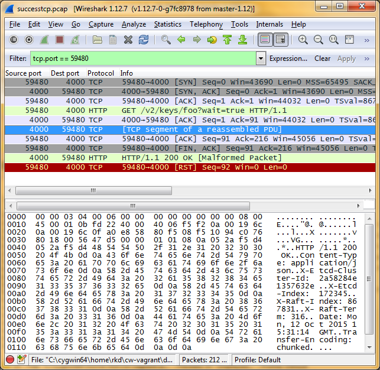
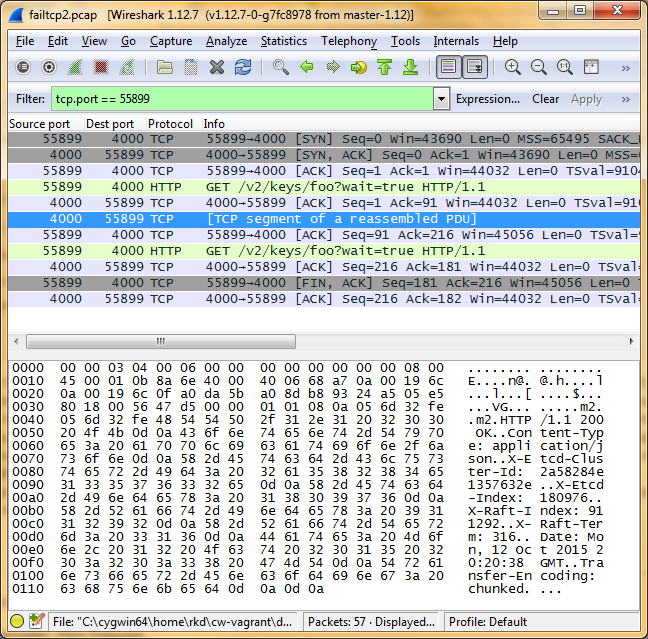

Adventures in debugging: etcd, HTTP pipelining, and file descriptor leaks
--------------------------------------------------------------------------
In Project Clearwater, we use [etcd](Etcd_1.md) to co-ordinate configuration and database topology between a cluster of nodes, which requires frequent short-lived polls of etcd. We’ve seen a problem where etcd exited at regular intervals, due to these polls leaking file descriptors, which we thought it was worth writing up. _UPDATE: After we posted this (to here and [Hacker News](https://news.ycombinator.com/item?id=10512343)) on Wednesday, we got a great response from the open-source community, so it should be possible to just use the simple solution of a watch with a short timeout in future. Specifically:_

*   _urllib3 have merged a fix to defensively close TCP connections on failure ([https://github.com/shazow/urllib3/pull/734](https://github.com/shazow/urllib3/pull/734)), so urllib 1.13 won’t have this problem._
*   _The etcd team have prototyped a waitTimeout parameter ([https://github.com/coreos/etcd/pull/3816](https://github.com/coreos/etcd/pull/3816)), which should make this function more usable for all HTTP clients._
*   _The etcd team also pinpointed the bug in Go’s HTTP stack which leaked the descriptor ([https://github.com/golang/go/issues/13165](https://github.com/golang/go/issues/13165)) – after a bit of discussion and some suggestions from us, this is now scheduled to be fixed in Go 1.6._

_Thanks to everyone who contributed to this!_

## Our architecture

Our etcd-using components, clearwater-cluster-manager and clearwater-config-manager, have two key requirements:

*   Because they’re used for co-ordinating amongst a cluster of servers (including [a multi-stage scale-up process](Etcd_2.md)), they need to react quickly when state in etcd changes – if we took the approach of doing a read every 30 seconds, it would take too long to move through all the scale-up phases and add a new node.
*   They need to terminate cleanly when stopped – they shouldn’t quit in the middle of rewriting /etc/clearwater/cluster_settings, but neither should they hang indefinitely.

The first requirement means that using etcd’s [watch API](https://github.com/coreos/etcd/blob/master/Documentation/api.md#waiting-for-a-change) is sensible – this allows you to send a HTTP GET, but not receive a response until something has changed (as opposed to sending a GET every second and causing more load) The second requirement complicates matters, though – we don’t want to be in the position where we’re trying to shut down clearwater-config-manager, but one thread is waiting for an etcd watch to complete, which may not happen for some time (it’s perfectly possible, for example, that the /etc/clearwater/s-cscf.json file will never change). We’ve dealt with this by setting a short timeout on the watch – every 5 seconds, we’ll stop watching, check whether we should quit, and start a new watch if not.

## The problem and our investigations

After implementing this, we started to see the etcd process exiting (and being restarted by our monitoring infrastructure) about once every 30 minutes. Checking the etcd logs, we saw this error just before it exited: `2015/05/20 17:40:25 etcdserver: failed to purge snap file open /var/lib/clearwater-etcd/10.151.118.4/member/snap: too many open files` Each process on a Linux system can only have a fixed number of open file descriptors (including both files and network sockets). By default, this limit is 1024 – this error shows that etcd has hit this limit, become unable to open more files, and exited. (If we’d had debug logging turned on – as we now do by default – we’d have got an even clearer log, ‘`etcdserver: 80% of the file descriptor limit is used [used = 1023, limit = 1024]`’) `lsof` (‘list open files’) is the usual tool to use for debugging file descriptor problems. lsof showed a lot of filehandles of the following form: `etcd 27580 clearwater-etcd 251u sock 0,7 0t0 7058723 can't identify protocol` And running ‘`lsof -p $(pgrep etcd) | wc -l`’ (which counts the number of open files) showed that the number of files opened by etcd was increasing every 5 seconds – in other words, every time we cancelled our watch and started a new one.

## Why do etcd watches cause a leak?

At this point, the evidence suggested that running etcd watches leaked file descriptors. We could have stopped there and just tried to minimise/avoid our use of etcd watches – but we thought it better to dig into the problem a bit more, partly to confirm that etcd watches were the problem, and partly to gain insight into possible fixes. First, we tried running single wget commands: `wget --tries=1 --timeout=1 -O - http://10.0.25.108:4000/v2/keys/foo?wait=true` But these didn’t leak file decriptors. However, we also wrote a Python script (etcdtest.py) that ran a number of watches with a very short timeout – and running 1,025 watches with this reliably caused etcd to exit.

    import urllib3
    import sys
    http = urllib3.PoolManager()
    number_of_requests = int(sys.argv[1])
    for i in range(number_of_requests):
        try:
            r = http.request('GET', 'http://10.0.25.108:4000/v2/keys/foo?wait=true', timeout=0.01)
        except (urllib3.exceptions.ReadTimeoutError, urllib3.exceptions.ConnectTimeoutError) as e:
            pass

We gradually bisected the problem down to the simplest case we could – running ‘python etcdtest.py 1’ to trigger one watch didn’t leak any file descriptors, but running ‘python etcdtest.py 2’ to trigger two watches did leak one file descriptor. We then took packet capture of the two scenarios to understand the difference. The TCP flow for one watch looked like this:

 But tellingly, the TCP flow for two watches (the case that leaked a socket) looked like this:

This behaviour is caused by two features of HTTP, namely connection reuse – where you can use the same TCP connection for multiple requests and responses – and pipelining – where you can send multiple requests over a TCP connection without waiting for a response, as long as when you read responses, you read them in order. So what’s happening in the failed case is:

*   We create TCP connection A ([the SYN/SYN,ACK/ACK handshake](https://en.wikipedia.org/wiki/Transmission_Control_Protocol#Connection_establishment)) and send HTTP request 1 over it
*   etcd immediately responds with a 200 OK with Transfer-Encoding: chunked – this starts the stream of HTTP data over which it will send us the next change
*   When urllib3 times out the request, we abandon HTTP request 1
*   On the second request, we see that TCP connection A already exists, so we reuse it and send HTTP request 2 over it. This is questionable behaviour, because although TCP connection A does exist, it’s got an outstanding abandoned HTTP request on it.
*   etcd doesn’t respond with a 200 OK to this request (there’s already an outstanding response on this TCP connection)
*   Eventually, Python exits, and closes TCP connection A, [by sending a FIN packet](https://en.wikipedia.org/wiki/Transmission_Control_Protocol#Connection_termination) – but etcd doesn’t send a FIN of its own, or send a zero-byte chunk to finish the 200 OK, as it does in the success case. This causes the socket to leak on etcd’s side – we think this is a bug in Go’s HTTP stack.

Incidentally, although we didn’t spot this at the time, these dead connections showed up in the output of ‘netstat -tnp’: `tcp 0 0 10.0.25.108:59171 10.0.25.108:4000 FIN_WAIT2 -` We initially missed them because they don’t report an affiliation with any process, so ‘netstat –tnp | grep etcd’ doesn’t catch them, but ‘`netstat –tnp | grep FIN_WAIT`’ does.

## Our first solution

Our first approach to solving this was to not break our etcd watch every five seconds – instead, we’d run a timeout-free watch. We still needed to shut the process down cleanly, though, without waiting for the eternal watch to complete – so we used Python’s concurrent.futures module to run the watch in a separate thread, and abandon that thread if we needed to terminate.

    executor = concurrent.futures.ThreadPoolExecutor(10)
    result_future = executor.submit(etcdclient.watch,
                                key,
                                index=wait_index,
                                recursive=False)
    term_future = executor.submit(self.wait_for_terminate)
    concurrent.futures.wait([result_future, term_future],return_when=concurrent.futures.FIRST_COMPLETED)

This caused follow-on problems, though - concurrent.futures has an atexit handler, which waits for all the threads it’s started to exit – which, in the case of the thread which is waiting on an etcd watch, may never happen. We were able to work around this by calling os._exit, which skips exit handlers, but:

*   this is a bit unpleasant – exit handlers are there for a reason!
*   any code that interfaced with this code (including utility scripts) had to quit by calling _exit – we didn’t remember this all the time, which left us vulnerable to bugs where our scripts just hung forever.

So we put our thinking caps on again, and came up with…

## Our second, better, solution

We subsequently took a second crack at the problem, and our approach this time was to mitigate the problem in urllib3, the python HTTP library we use. We only hit this problem when we sent a HTTP request over a TCP connection, timed out that request and abandoned it, and then sent a subsequent request over that TCP connection – which is questionable behaviour, due to the nature of HTTP pipelining. We were able to put a one-line fix ([https://github.com/Metaswitch/clearwater-etcd/commit/4b9cbadbd7489a2307c9fbd03c6ba840e94499bd#diff-250e1091fc9c18b01f41246f6c63a87aR88](https://github.com/Metaswitch/clearwater-etcd/commit/4b9cbadbd7489a2307c9fbd03c6ba840e94499bd#diff-250e1091fc9c18b01f41246f6c63a87aR88)) in to close any TCP connections where we’d timed out a request, on the basis that they were now unsuitable for reuse. Because Python is a dynamic language, we were actually able to apply this patch at runtime – we didn’t need to fork urllib3 and maintain our own copy (whereas if we’d tried to solve the problem with changes in etcd, we would have needed to do that, because etcd is written in Go and can’t be patched at runtime).

## The long-term solution

Fundamentally, there’s no protocol-level way to cancel a HTTP request – the best you can do is abandon it and close the connection, which always risks a leak. See [https://lists.w3.org/Archives/Public/ietf-http-wg/2003OctDec/0012.html](https://lists.w3.org/Archives/Public/ietf-http-wg/2003OctDec/0012.html) for more details. The right fix here, as that link recommends, is to build cancellation/timeout behaviour into the HTTP application itself. If etcd allowed you to specify a timeout flag on requests, and etcd itself stopped doing any work and closed the connection after that many seconds, that would substantially improve matters – we wouldn’t have to abandon half-complete TCP sockets to get cancellation behaviour. [https://github.com/coreos/etcd/issues/2468](https://github.com/coreos/etcd/issues/2468) covers this kind of behaviour for etcd, and we’re watching that with interest – and in fact, we’re considering implementing our own “timeout” API option and submitting that upstream, in order to spur more movement on this issue.
