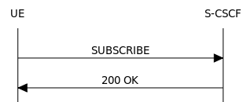
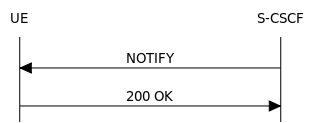

Expiring Subscriptions in Project Clearwater
--------------------------------------------
We have recently been looking at our support of SUBSCRIBE/NOTIFY behaviour, in particular looking at how we can further improve our processes for sending out NOTIFYs to end users, and how we expire out of date subscriptions. Before covering some of the changes we’ve made, I should begin with an overview of SUBSCRIBE behaviour. Those already familiar with the standard flows can move on to the second section dealing with the work that we’ve been doing.

## SIP SUBSCRIBEs

SIP SUBSCRIBEs provide a means for any end point in a network to receive information on any resource or call state that it is authorised to access. The S-CSCF will provide information on these states in the form of a NOTIFY message at the point of subscription, and at any point the resource state changes while the subscription is still active, as well as when the subscription expires. At a high level, the following describes the standard SUBSCRIBE behaviour. For simplicity the diagrams are limited to showing only the UE and S-CSCF:

*   A UE sends in a SUBSCRIBE:

*   The 200 OK message is only sent out after the S-CSCF has performed all of the necessary processing: validating the SUBSCRIBE request, calling up the associated data record, modifying the correct entry, and storing the data successfully
*   At this point the S-CSCF sends out an initial NOTIFY to the subscribed UE:

*   Once the subscription is set up, and remains valid, any update to the subscribed resource state (currently only UE registrations are supported) will trigger another NOTIFY to be sent to the UE

The body of the NOTIFY itself contains the information on the subscribed resource state, using the reginfo.xml format specified in [RFC 3680](https://tools.ietf.org/html/rfc3680). An example NOTIFY body would look like the following:

    <?xml version="1.0"?>
       <reginfo xmlns="urn:ietf:params:xml:ns:reginfo"
           xmlns:xsi="http://www.w3.org/2001/XMLSchema-instance"
                    version="0" state="full">
         <registration aor="sip:user@example.com" id="as9"
                       state="active">
           <contact id="76" state="active" event="registered"
                    duration-registered="7322"
                    q="0.8">
                    <uri>sip:user@pc887.example.com</uri>
           </contact>
           <contact id="77" state="terminated" event="expired"
                    duration-registered="3600"
                    q="0.5">
                    <uri>sip:user@university.edu</uri>
           </contact>
         </registration>
       </reginfo>

In the above, each ‘registration’ entity in the xml body represents a public user identity, with each ‘contact’ element below them representing a registered binding. When a subscribed user receives a message of this format, they can pull out information on every currently registered user, with other attributes able to provide information on the current state of each registration (whether it is active, being refreshed or terminated, or if it new etc.) A subscription is considered expired when its expiry time, set when it was created or last updated, has passed, or when all registrations associated with the subscription are removed.

## Our Changes

Up until recently, Project Clearwater has triggered subscription timeout termination at the first point the data record containing the subscription information is accessed after the expiry time has passed. However, as we already have infrastructure in place, in the form of [Chronos](Chronos.md), to store a timer, and use it to prompt the active timing out of registrations, we have decided to use the same structure to ensure that subscriptions are timed out as accurately and actively as possible. We have also reworked the NOTIFY body that is sent out on a subscription termination to include a full xml body, detailing the entire view held on the registration set, rather than a set of deltas indicating changes since the last update. While the delta method is recommended in the RFC specifications, we are pushing to be ever more compliant to the [IMS spec](http://www.etsi.org/deliver/etsi_ts/124200_124299/124229/10.20.00_60/ts_124229v102000p.pdf), which requires a full body to be sent at every point. With this new behaviour we are now able to actively terminate an expiring subscription, and we are sending out correctly formed termination NOTIFYs to the user, fully compliant with RFC and IMS specifications.
