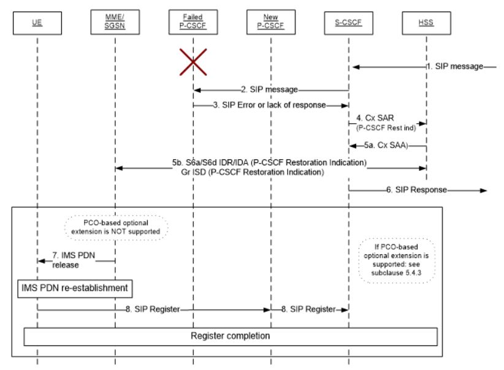

HSS-based P-CSCF restoration
----------------------------

As an IMS core, Project Clearwater's I- and S-CSCF can be used within a VoLTE Solution, providing voice service to 4G (LTE) mobile subscribers. It is then possible for a P-CSCF to fail independently of the S-CSCF. Since UE's do not monitor the P-CSCF, the UE will be unaware of the P-CSCF failure until it tries to re-register due to registration timer expiry, which could be a long time depending on the operator's choice for registration timer. Meanwhile, all MT (Mobile Terminated) calls to every subscriber on the failed P-CSCF will fail. MO (Mobile Originated) calls would detect the failure and trigger the device to re-register with the 2nd P-CSCF received in the PCO from the PGW during the original IMS attach request.

3GPP TS 23.380 provides several possible restoration mechanisms for recovery from P-CSCF failure. One such mechanism is "HSS-based P-CSCF restoration for 3gpp access" as defined in section 5.4.

_Figure 5.4.2.1-1 from 3GPP TS 23.380_

_How does it work?_ The feature works like this for a Public User Identity (IMPU) registered with only one Private User Identity (IMPI):

*   The S-CSCF receives an MT call (1) and forwards to the UE's terminating P-CSCF (2)
*   The S-CSCF identifies that the P-CSCF has failed (3). This could be due to no response, a transport error or certain other error codes (e.g. the UE's registration data is not present).
*   Having identified the failure, the S-CSCF checks the registration status of the IMPU and determines that there is a single IMPI registered. A Cx SAR is sent to the HSS that contains a P-CSCF restoration indication with the intention that this IMPI is un-registered (4).
*   HSS attempts to implement the restoration process in conjunction with various EPC functions resulting in the UE registering via another P-CSCF so that future MT calls will succeed
*   The HSS determines whether the MME / SGSN serving nodes support the P-CSCF restoration for that UE. If this is supported, then the HSS sets the registration state to UN-REGISTERED and sends a successful Cx SAA response to the S-CSCF (5a). The HSS then sends a P-CSCF restoration indication using either S6a/S6d IDR/IDA or Gr ISD request/answer (5b).
*   The MME/SGSN will prompt the UE to remove it's IMS PND connection (7), at which point the UE will activate a new IMS PDN connection and perform a new initial registration (8).

_What if HSS-based P-CSCF restoration is not supported?_ If either the HSS or MME/SGSN do not support the feature, then the registration state of the UE is not updated. It makes more sense to keep the existing registration lest the P-CSCF failure is temporary one. In this case, the HSS provides an error response in the Cx SAA to the S-CSCF.

_What happens if there are multiple registrations?_ As well as the single registration case, we may have multiple IMPI/IMPU pairs registered, only one of which is attached to a failed P-CSCF. P-CSCF restoration can still take place as above, but rather than changing the state to UN-REGISTERED, the S-CSCF instead requests that the relevant IMPU/IMPU pair alone is DEREGISTERED. In this way, the remaining pairs are left intact.

Enhancing Project Clearwater to implement this feature could be an interesting project.
