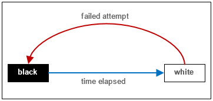
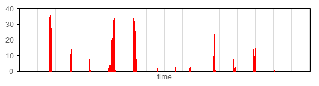
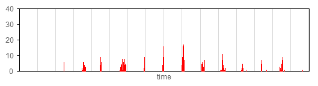
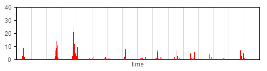
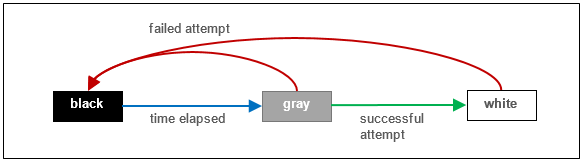
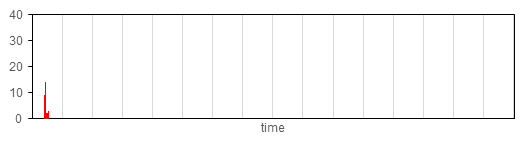
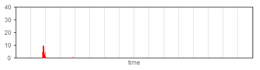
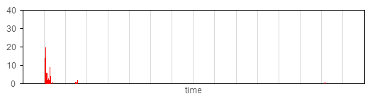

HTTP Graylisting
----------------

In this blog post, we’ll take a look at the HTTP Graylisting feature that will be introduced into Project [Clearwater](../pages/Architecture.md) in the Kangaskhan release. This feature improves the way that Clearwater deals with failed Homestead and Ralf nodes, meaning that calls will process faster and experience fewer failures when some of the nodes are down. In particular, it significantly reduces the call failure rate in the minutes after losing several Homestead nodes simultaneously, for example in the event that a physical machine fails. The remainder of this post will focus on the connection between Sprout and Homestead – but the connection between Sprout and Ralf is enhanced in the same way.

## Connecting to Homestead

When making a call, or performing a number of other functions, Sprout contacts a Homestead node over HTTP. In a deployment with multiple Homestead nodes, the process for connecting is as follows.

*   A list of several of the Homestead nodes is produced, and the call will attempt to connect to the first of these nodes.
*   If this node is down, the attempt fails, and the next node in the list is attempted.
*   Each failed attempt increases the time taken to process the call; too many failures causes Sprout to stop trying to connect and the entire call fails.

In order to prevent a constant stream of requests to a failed node, all of which will fail, Sprout uses _blacklisting_. When an attempt to connect to a node fails, that node is _blacklisted_. A blacklisted node is not selected for calls, provided there are sufficient non-blacklisted nodes, so no attempts to contact this node will be made. After a configurable time (http_blacklist_duration, defaulting to 30s) the node is removed from the blacklist, and the node will be selected as usual once again. The aim of the blacklist system is to minimise the number of failed attempts while keeping traffic distributed over working nodes.

_Node States in the Blacklist System_

## Behaviour During Failures

When a node is removed from the blacklist it can immediately be selected for multiple calls, the same as any functioning node. However, if the node is still down, any attempts made to connect to it will fail. With just one failed node, this causes increased call processing time for a potentially large number of calls. The same problem reoccurs every blacklist period, each time the node is removed from the blacklist and then blacklisted once more. Worse still is the case in which multiple nodes fail simultaneously; for example, failure of a physical server could take down several virtual machines. These nodes will be blacklisted at approximately the same time, so will be removed from the blacklist at approximately the same time too. Calls may be given several failed nodes leading to complete failure of these calls. Again, this problem repeats periodically. The graphs below show the number of SIP errors over time when running stress (using [clearwater-sip-stress](http://clearwater.readthedocs.io/en/latest/Clearwater_stress_testing.html) with 30,000 subscribers) through a deployment with three working Homestead nodes. At time zero, DNS was reconfigured to simulate simultaneous failure of multiple Homestead nodes (as the nodes were deployed in AWS it was not possible to fail a physical host). The periodic spikes of call failures are clearly visible. The difference in spike heights is due to the random element in the distribution of hosts. The “area” of the spike is proportional to the total number of call failures.

_Call Failures over Time during Stress. Vertical lines denote 30s intervals. The delay before the initial spike is caused by the varying time required for the DNS entries to propagate._

## The New Graylisting Feature

In order to solve this problem, the _graylisting_ feature has been introduced. When a Homestead node is removed from the blacklist, it moves to the _graylist_. Nodes on the graylist are selected for just one call at a time, and a call will be given at most one graylisted node, provided there are sufficient working nodes available. This call attempts to connect to the graylisted node, and reports the success or failure of this attempt. If the attempt succeeded, the node is removed from the graylist and will return to being selected as usual. If the attempt failed, the node is returned to the blacklist. The call should still be processed successfully as the remaining nodes passed to the client are (nominally) working – no call should attempt to contact more than one failed Homestead node.

_Node States in the Blacklist System with Graylisting_

Using this system, if a node is still down when it is removed from the blacklist, the only consequence is an increase in call processing time for a single call. If the node is working, the call will connect quickly, and the node returns to being selected as usual once again.

## The Effect of Graylisting

The graphs below show the number of failed calls over time when running stress through a deployment as above, but with the graylisting feature. The initial spike of failures when the DNS entries reach the system is still present, because a (not yet blacklisted) homestead fails and affects multiple calls, however the periodic spikes of failures have been all but completely eliminated.

_Call Failures over Time during Stress with Graylisting. Vertical lines denote 30s intervals. The delay before the initial spike is caused by the varying time required for the DNS entries to propagate._

We have seen that fault tolerance between Sprout and Homestead is improved; as the interface between Sprout and Ralf is also HTTP, fault tolerance is improved here too. We are looking to extend the feature to other protocols, and we are currently working on a way to reduce the number of call failures caused by the initial node failure.
