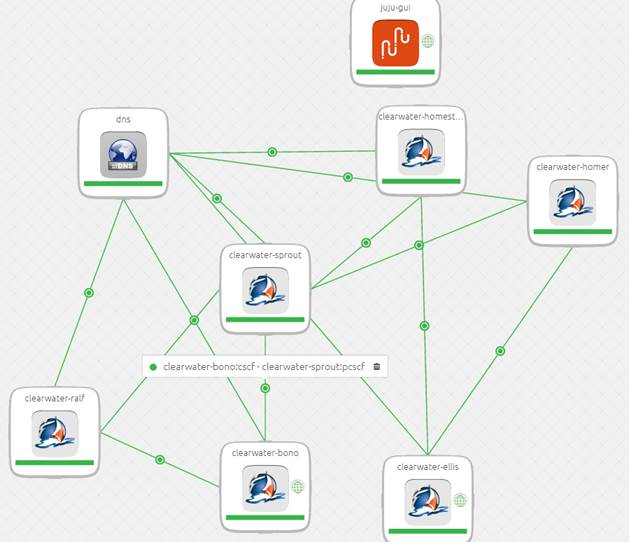

Clearwater and Juju
-------------------
Like [our sister project, Calico](http://www.projectcalico.org/exploring-juju/), we on the Project Clearwater team have been using Juju for some of our orchestration needs. In this blog post, I'm going to talk about what Juju is, why it's a good fit for IMS orchestration, and what we've done recently on our Juju charms. Both the Calico blog linked to above and [the main Juju site](https://jujucharms.com/about) talk about what Juju is in detail, so I'm only going to summarise it briefly here. Put simply, Juju is an orchestration platform - a way to automatically and repeatably deploy and configure network services, whether that's a simple Wordpress blog (the usual Juju example) or a full, interconnected IMS core like Clearwater. (Juju has some specific terminology - "charms" are configuration describing a specific service, and a "bundle" is a group of related charms). What's different about Juju, compared to related tools like Chef or Puppet, is that instead of focusing on the details of deploying each node (what packages do I install, which config files do I write out), Juju is concerned with managing the relationships between nodes. Each node gets told when its "relations" join or depart the cluster, so that when a new Sprout node (for example) is added, all the Bono nodes learn about it and can start directing traffic to it. The concept of “relations” works particularly well for Clearwater, because there are well-defined and well-known IMS interfaces between nodes. For example, our clearwater-bono charm [exposes](https://github.com/Metaswitch/clearwater-juju/blob/dnsaas/charms/precise/clearwater-bono/metadata.yaml#L13) the IMS Mw interface for S-CSCFs to connect to, and the Gm interface for UEs. The fact that relationships are shown in the Juju GUI also means that your Clearwater deployment actually (kind of) looks like an IMS network diagram:

Because Juju works on the level above Chef and Puppet like this, it's possible to use them together - in fact, the [Juju FAQ](http://insights.ubuntu.com/2013/08/29/top-12-questions-about-juju/) encourages it. This is great for us - it means we can hook into [our existing Chef scripts](https://github.com/Metaswitch/chef) from our Juju charms, reuse all that battle-hardened code for installing the right packages and tweaking the right config files, and let Juju manage the deployment-wide picture and relationships. In the past couple of sprints (Dune and East of Eden), we've been making some improvements to our charms: besides general tidying-up and bug-fixing, we’ve now tested against the latest Juju version (1.23), successfully deployed Clearwater with Juju on OpenStack Juno (we’d previously only used Amazon EC2), and added a [clearwater-sipp charm](https://github.com/Metaswitch/clearwater-juju/tree/dnsaas/charms/precise/clearwater-sipp) for stress testing. If you'd like to see a three-minute video of a Clearwater system being managed and scaled by Juju, [there's one on Youtube here](https://www.youtube.com/watch?v=Tsa0QgffZ28). If that whets your appetite, and you'd like to try this yourself, it's pretty simple:

*   Follow [the Juju "Getting Started" guide](https://jujucharms.com/docs/stable/getting-started) to create an EC2 or OpenStack deployment
*   Install juju-deployer and git (sudo apt-get install juju-deployer git)
*   Follow our instructions at [https://github.com/Metaswitch/clearwater-juju/blob/dnsaas/README.md](https://github.com/Metaswitch/clearwater-juju/blob/dnsaas/README.md) to deploy the Clearwater bundle
*   You now have your own, working, Clearwater IMS core - you're ready to [make your first phone call](http://clearwater.readthedocs.org/en/latest/Making_your_first_call/index.html)!

If you have problems or questions, you should check the [Juju documentation](https://jujucharms.com/docs/stable/about-juju) for help with Juju, and the Clearwater [troubleshooting guide](http://clearwater.readthedocs.org/en/latest/Troubleshooting_and_Recovery/index.html) and [general documentation](http://clearwater.readthedocs.org/) for Clearwater.
