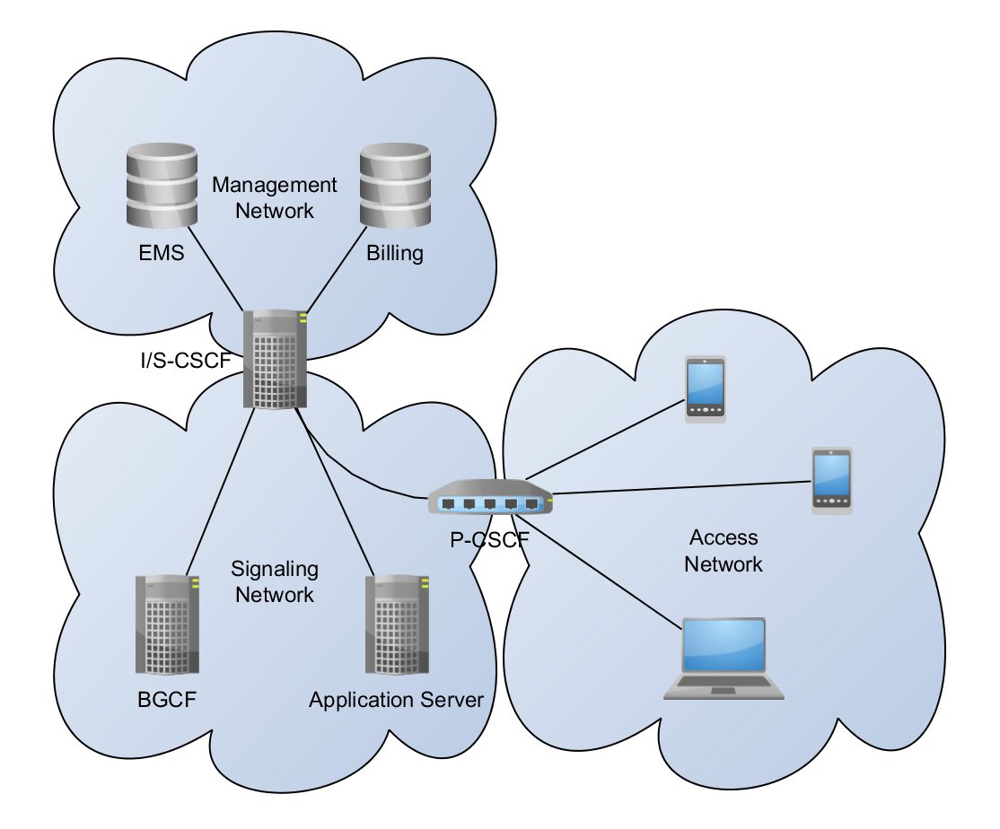

Multiple Networks Support (Part 1)
----------------------------------
In the Ultima release, we announced that we'd added support to Clearwater to separate signalling and management traffic onto separate network interfaces. If you're looking for instructions to enable this feature on your existing Clearwater deployment, please refer to [our documentation](https://clearwater.readthedocs.org/en/latest/Multiple_Network_Support/index.html). This series of posts will cover the design process we went through and how we settled on the solution we eventually did.

## The Problem

In a Telecom operator's network there are communications that must not be leaked to the public. Examples of these might be billing information, subscriber contact details or other sensitive data. Because of how damaging it might be if these communications were leaked it's crucial that they are kept as far away as possible from public-facing communications. Telecom Operators also need to ensure that these communication channels are never overloaded, since otherwise (potentially valuable) information may be lost due to packet drops etc. This means they need a mechanism to prevent a public endpoint from being able to saturate the network links that these communications run over.

## Picking a High Level Approach

Given this problem, there are a few high-level approaches that we could take to solve it. At this point, we can discount some of these approaches cheaply. Later we'll draw up some more concrete requirements to check against more detailed solution ideas.

### Dedicated Devices

For some communications, separation can be achieved simply by handing sensitive communications on dedicated devices that are separated from the user-facing parts of the network (e.g. passing lawful-intercept streams to the authorities over a dedicated copper cable), but, in the majority of cases, the same component in the network that's involved in these sensitive communications is also involved in handling traffic from the public (e.g. in an IMS network, the S-CSCF handles both SIP traffic from endpoints and accessing the HSS subscriber database).

### Firewalls

In non-Telecoms networks (e.g. for a web-server deployment) it's common to see firewalls being deployed to police access to traffic. Firewalls can provide some of the required protection if correctly configured, but do have their issues:

*   They can be fiddly to get configured correctly (especially in a horizontally-scaled orchestrated environment, where firewall rules now need to be updated whenever an instance is added or removed from the network)
*   It can be hard to confirm that the protection is completely reliable, especially in complex network topologies.
*   A compromised device behind the firewall can still see (and snoop on) all traffic that's flowing over the protected channels.
*   If a rogue endpoint can get enough packets through the firewall (even if these packets are later rejected), they may be able to saturate the protected network to the extent that they affect traffic on the secured channels.

These limitations explain why Telecom Operators rarely rely on just firewalls to protect their network traffic.

### Separated Networks

Telecom Operators have historically split their communication channels into two (or more) distinct networks (often using dedicated network hardware for each to further separate them) and ensured that traffic is routed over the appropriate network using a variety of solutions.

All major Linux distributions support having two (or more) network interfaces and connecting each one to a separate network (you may have two network ports in the back of your computer, especially if you're looking at a server). Since this is a proven and familiar solution in the Telecoms field, we determined that this would be the approach Project Clearwater would take. We decided we would use two distinct networks, one for signalling traffic (publicly accessible, though possibly protected by an SBC/P-CSCF) and one for management traffic (used for private communications).

## Our Requirements

Now that we understand the problem at hand and have a high-level plan for how we’re going to proceed, we should lay out actual requirements for the solution so we can check that proposed solutions will do what we want.

### Network Segregation

One of the crucial requirements we have for this feature is to guarantee that signalling traffic cannot leak into the management network and vice-versa. This prevents a DoS attack on the signalling network (which can be driven from the public internet) attacking the management network (often an internal network) and prevents management traffic (which may contain sensitive information) from being spied on from the signalling network.

### Network Flexibility

We also didn't want to put too many restrictions on how the networking for a Clearwater instance has to be set up as some users have very specific networking requirements already which may conflict with overly specific requirements from us. In particular, we didn't want to restrict that the management (or signalling) network had to be a single subnet, or to require that the address spaces of the two networks be non-overlapping.

### Ease of Configuration

We obviously want this feature to be easy to use. Often network configuration becomes very involved and fragile and we wanted to avoid creating a feature that no-one can deploy because it conflicts with their existing network topology or networking requirements.

## Available Tools

Linux contains a fairly complete suite (see [https://www.tldp.org/HOWTO/Adv-Routing-HOWTO/](https://www.tldp.org/HOWTO/Adv-Routing-HOWTO/) for a good collection of resources) of IP routing and policing tools. We were sure that within that list, we'd find something that would allow us to achieve our goals. The key tools that we looked at are:

*   [routing tables](http://linux-ip.net/html/routing-tables.html) - The Linux outbound routing engine.
*   [iptables](http://www.netfilter.org/projects/iptables/index.html) - A firewall built in Linux which has a very powerful packet inspection and marking/policing engine.
*   [network namespaces](http://lwn.net/Articles/580893/) - These partition the use of the network—devices, addresses, ports, routes, firewall rules, etc. into separate boxes.

## Next Time

In the [next post](Multiple_Networks_2.md) we look at these options in detail, discuss their pros and cons and why (spoilers!) we settled on network namespaces for Project Clearwater.
