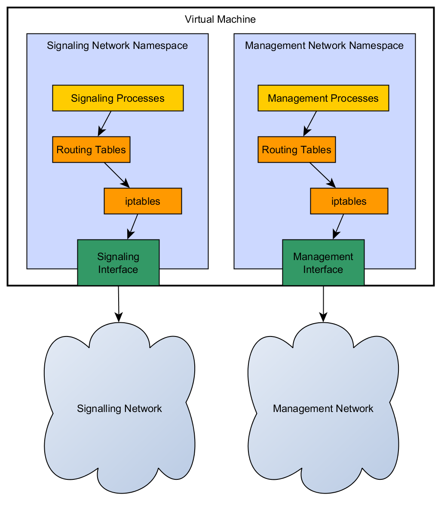
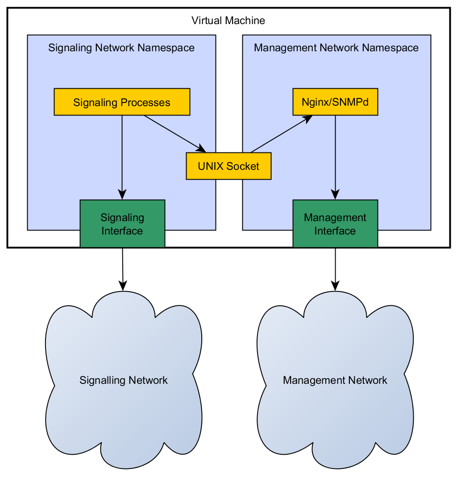

Multiple Networks Support (Part 3)
----------------------------------
This is part 3 of a series of blog posts discussing the design process we went through when enabling multiple network support in the Ultima release of Project Clearwater. Part 1 of this series can be found [here](Multiple_Networks_1.md). If you're looking for instructions to enable this feature on your existing Clearwater deployment, please refer to [our documentation](https://clearwater.readthedocs.org/en/latest/Multiple_Network_Support/index.html) In the [last post](Multiple_Networks_2.md), we looked at and discounted two possible solutions to our problem. In this last post, we'll discuss the solution we settled on and the ramifications of that decision.

### Network Namespaces

Having looked at two options that weren't strict enough to conform to our needs, we turned to [network namespaces](https://lwn.net/Articles/580893/). These work by segregating processes and network resources into "namespaces" that do not allow processes from one namespace to see networking resources from another namespace. Each namespace has it's own interfaces, iptables rules, routing table etc. This allows for very exact control of networking decisions by making it impossible for a process in one namespace to accidentally use the network interfaces from another namespace. Specifically for our needs, they give us the ability to support overlapping networks as the routing is completely separated between namespaces. The following diagram shows how this namespace concept works:

The standard network-using processes (SSHd, NTPd, DNS etc.) all run in the default namespace unless you manually move each of them, which would contradict our ease of configuration requirement. Hence it makes sense to call the default namespace the management namespace and to create a special signalling namespace that the Clearwater components will run in. We place one of the network interfaces into the signalling namespace, which has a two-fold effect, making it invisible to services in the default namespace and making it visible to the Clearwater components. The other interface stays in the default namespace and is therefore visible only to the management services. This guarantees the network segregation we require. This function might appear quite involved or complicated (the implementation of network namespaces is closely intertwined with the Linux kernel's networking stacks) but this is the same technology used in [Docker](https://www.docker.com/) to ensure network segregation and security so we feel very confident using it in Project Clearwater.

## So we're done, right?

Not quite, network namespaces tick all our boxes in terms of separation and simplicity of configuration, but unfortunately there are some situations where a single component wishes to communicate on both networks. The common reason for this is where two processes communicate over a network interface internally (e.g. Homestead, Cassandra and Homestead-provisioning). Since each network namespace has a separate `localhost` we need all three of those components to run in the same namespace so they can communicate over the same `localhost` interface. As one of the processes (here Homestead-provisioning) needs to provide service on the management network and another (here Homestead) needs to provide service on the signalling network we can see that we're stuck. We can't put all the services into the signalling namespace, as then they can't reach the management network, we can't do the reverse (for the opposite reason)...

### The Easy Bit

When looking at this problem, we realised that, although the network interfaces are strongly sand-boxed between namespaces, [UNIX domain sockets](http://beej.us/guide/bgipc/output/html/multipage/unixsock.html) are not subject to the same separation. This allowed us to resolve most of the problems we introduced by adding network namespaces. For example, we made Homestead-provisioning run in the signalling namespace (so it can reach Cassandra) but we made it listen on a UNIX domain socket with a well-known name and we now start an instance of [Nginx](http://wiki.nginx.org/Main) in the management namespace which proxies HTTP requests to the UNIX domain socket to be handled by Homestead-provisioning. We did something similar with our ZeroMQ statistics, exposing them over UNIX domain sockets and changing our SNMPd plugins to listen for statistics on those sockets. Now SNMPd (and our plugins) runs in the management namespace but, by connecting to the domain socket, it can still read and report statistics from components that are running in the signalling namespace.

### The Hard Bit

The final hurdle we had to overcome was our SAS client. [SAS](http://www.metaswitch.com/products/management-systems/service-assurance-server) is an analytic tool produced by Metaswitch Networks that allows detailed analysis of call flows and provides useful diagnostics to the operator. Project Clearwater has had SAS integration for a long time (the diagnostics are too good to go without!). We wanted to communicate with the SAS server over the management network (as the SAS server can contain sensitive records, like user configuration). We therefore looked at writing a small proxy component to perform the same role as Nginx in the HTTP cases, but we were concerned about performance (as the SAS connection is used heavily when enabled) and window conditions during recovery from failures. Then we discovered that it's possible to pass sockets between processes over a UNIX domain socket connection. So we now run a simple [helper process](https://github.com/Metaswitch/clearwater-infrastructure/blob/master/clearwater-socket-factory.md) in the management namespace which listens on a UNIX domain socket with a well known name. When a process in the signalling namespace wishes to connect to SAS, it instead connects to that domain socket. The helper process then connects to SAS (over the management network, since it is in the management namespace) on the signalling process's behalf. Once the connection is established, the helper process passes the connected socket over the UNIX domain socket to the signalling process. The signalling process can then use that socket to send diagnostic information to SAS. 

## Bringing It All Together

The rest of the work required was simply ensuring all the required processes are started in the correct namespaces and that they can reach each other over their various UNIX domain sockets. With network namespaces we get our required level of separation and, with some nifty bash scripting, the configuration to turn this feature on is as simple as creating a signalling namespace, configuring the signalling network within that namespace to fit your requirements and then configuring the namespace's name in `/etc/clearwater/config` (for more details, see [the docs](https://clearwater.readthedocs.org/en/latest/Multiple_Network_Support/)). Easy!
