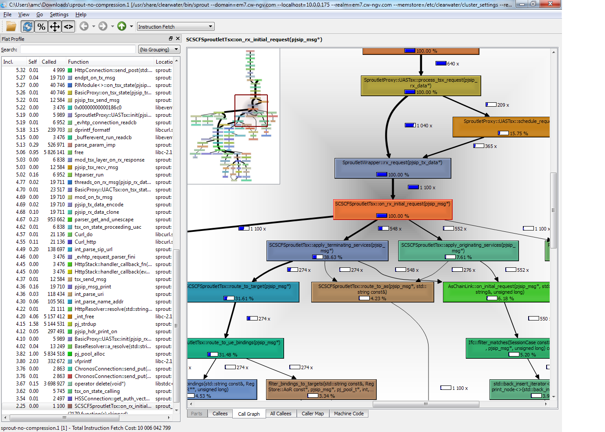

# Profiling Clearwater Performance

One of Project Clearwater’s key design goals is to scale to support huge telephone services (in the tens of millions of subscribers range). In general all the Project Clearwater node types are capable of running in horizontally-scalable clusters such that we can support more subscribers by adding more node types. On top of this, we’ve tried to make each instance of each component support as many subscribers as possible so large deployments don’t require thousands of instances to support their load. Obviously, as we add more function and features to Project Clearwater, it’s natural that the overall performance of each component will be affected, but we’re taking steps now to try and keep track of exactly how fast our code is and to watch out for performance degradations that we can eliminate or reduce with a bit of re-architecting or a simple bug fix.

## Gathering Performance Numbers

Debugging and explaining performance changes in a complex codebase (like Clearwater) can be a difficult task, it’s not like debugging a crash where a debugger or core file can give you a snapshot of what’s wrong at the point of the error, you have to work with heuristics and large datasets and try to spot patterns that suggest where the error may lie. Fortunately there are various tools that have been developed that can determine where a process is spending its time and report that information in various ways to help with the analysis.

### top

Starting with our simplest tool, `top` is a command-line tool included in all mainstream Linux distributions that can give an idea of which processes are using the CPU and how much they are using relative to each other.

    top - 13:48:02 up 31 days,  1:31,  2 users,  load average: 0.21, 0.22, 0.22
    Tasks: 134 total,   2 running, 125 sleeping,   0 stopped,   7 zombie
    %Cpu(s):  2.2 us,  0.9 sy,  0.0 ni, 85.9 id,  4.4 wa,  0.0 hi,  0.0 si,  6.6 st
    KiB Mem:   2048532 total,  1968744 used,    79788 free,     9064 buffers
    KiB Swap:        0 total,        0 used,        0 free.   230152 cached Mem

      PID USER      PR  NI    VIRT    RES    SHR S %CPU %MEM     TIME+ COMMAND
    17845 clearwa+  20   0   20712   9620   2148 S  1.0  0.5 460:50.64 etcd
        8 root      20   0       0      0      0 R  0.3  0.0  57:09.06 rcuos/0
      203 root      20   0       0      0      0 S  0.3  0.0  10:43.60 jbd2/xvda1-8
     3551 root      20   0 2417628  27832   5488 S  0.3  1.4   0:01.60 chronos
     4450 sprout    20   0 2032868 112860  10956 S  0.3  5.5   0:08.80 sprout

Here you can see how much %CPU and %MEM each process is using (along with various other statistics). This is the main tool we use to spot when performance has noticeably dropped, since the ratio of call rate to CPU% usage will change (alternatively, the maximum call rate before we hit 100% CPU will be lower). The other useful bit of information in `top`’s output is the row of total percentages at the top of the output. These tell you how much of real time is spent doing various categories of work. The interesting entries are:

*   `us` - userspace (your programs)
*   `sy` - system (the kernel and associated drivers etc)
*   `id` - idle (spare CPU cycles)
*   `wa` - iowait (blocked on disk accesses)
*   `st` - steal (blocked by the virtualization layer)

By looking at the relative sizes of `us`, `sy` and `wa` we can determine where to focus our performance efforts (e.g. optimising our program’s architecture, reducing calls into the kernel or batching up disk accesses respectively). Having decided which of these three areas we want to investigate more closely, we can move on to more specialist tools.

### User Time - `callgrind`

For profiling user-space function you can use one of the excellent [`valgrind`](http://valgrind.org/) suite of tools, [`callgrind`](http://valgrind.org/docs/manual/cl-manual.html), a “call-graph generating cache and branch prediction profiler”. `callgrind` works by running your user-space process in an emulated processor and literally counting CPU cycles to work out exactly where the CPU is spending time in your programme. Because of it’s in-depth approach, `callgrind` can tell you exactly how much each line of code is costing and can give you (though [kcachedgrind](http://kcachegrind.sourceforge.net/html/Home.html) or [qcachegrind](http://sourceforge.net/projects/qcachegrindwin/)) a graphical display of the hotspots in your process.

### Kernel Time - `strace` and `perf`

If `top` indicates that kernel usage is unexpectedly high, one of the main approaches to determine why is to look at the output of [`strace`](https://en.wikipedia.org/wiki/Strace). `strace` attaches to your running process (or you can start your process under strace if you wish) and prints out every `syscall` (call into kernel space) that your process makes, along with the arguments and how long it too that call to complete. An example from a running instance of `sprout` as it handles an `OPTION` poll:

    epoll_wait(9, {{EPOLLIN, {u32=3712482168, u64=139688933849976}}}, 16, 10) = 1 <0.001574>
    [pid 25719] accept(12, {sa_family=AF_INET, sin_port=htons(44526), sin_addr=inet_addr("10.0.0.248")}, [16]) = 1084 <0.000012>
    [pid 25719] ioctl(1084, FIONBIO, [1])   = 0 <0.000055>
    [pid 25719] getsockopt(1084, SOL_SOCKET, SO_TYPE, [1], [4]) = 0 <0.000009>
    [pid 25719] epoll_ctl(9, EPOLL_CTL_ADD, 1084, {EPOLLERR, {u32=3705376432, u64=139688926744240}}) = 0 <0.000011>
    [pid 25719] epoll_ctl(9, EPOLL_CTL_MOD, 1084, {EPOLLIN|EPOLLERR, {u32=3705376432, u64=139688926744240}}) = 0 <0.000068>
    [pid 25719] epoll_wait(9, {{EPOLLIN, {u32=3705376432, u64=139688926744240}}}, 16, 10) = 1 <0.009104>
    [pid 25719] epoll_ctl(9, EPOLL_CTL_MOD, 1084, {EPOLLERR, {u32=3705376432, u64=139688926744240}}) = 0 <0.000010>
    [pid 25719] recvfrom(1084, "OPTIONS sip:poll-sip@10.0.0.248:"..., 4000, 0, NULL, NULL) = 343 <0.000023>
    [pid 25719] gettimeofday({1439468356, 389180}, NULL) = 0 <0.000009>
    [pid 25719] gettimeofday({1439468356, 389269}, NULL) = 0 <0.000010>
    [pid 25719] recvfrom(1084, 0x215b2ef, 3657, 0, 0, 0) = -1 EAGAIN (Resource temporarily unavailable) <0.000011>
    [pid 25719] epoll_ctl(9, EPOLL_CTL_MOD, 1084, {EPOLLIN|EPOLLERR, {u32=3705376432, u64=139688926744240}}) = 0 <0.000010>
    [pid 25719] epoll_wait(9, {{EPOLLIN, {u32=3705376432, u64=139688926744240}}}, 16, 10) = 1 <0.000043>
    [pid 25719] epoll_ctl(9, EPOLL_CTL_MOD, 1084, {EPOLLERR, {u32=3705376432, u64=139688926744240}}) = 0 <0.000010>
    [pid 25719] recvfrom(1084, "\r\n", 3657, 0, NULL, NULL) = 2 <0.000015>
    [pid 25719] gettimeofday({1439468356, 389987}, NULL) = 0 <0.000009>
    [pid 25719] gettimeofday({1439468356, 390063}, NULL) = 0 <0.000014>
    [pid 25719] futex(0x9c2f9c, FUTEX_WAKE_OP_PRIVATE, 1, 1, 0x9c2f98, {FUTEX_OP_SET, 0, FUTEX_OP_CMP_GT, 1}) = 1 <0.000013>
    [pid 25716] <... futex resumed> )       = 0 <12.468588>
    [pid 25719] futex(0x9c2f40, FUTEX_WAKE_PRIVATE, 1 <unfinished ...>
    [pid 25716] futex(0x9c2f40, FUTEX_WAIT_PRIVATE, 2, NULL <unfinished ...>
    [pid 25719] <... futex resumed> )       = 0 <0.000066>
    [pid 25716] <... futex resumed> )       = -1 EAGAIN (Resource temporarily unavailable) <0.000077>
    [pid 25719] recvfrom(1084,  <unfinished ...>
    [pid 25719] <... recvfrom resumed> 0x215b198, 4000, 0, 0, 0) = -1 EAGAIN (Resource temporarily unavailable) <0.000099>
    [pid 25719] epoll_ctl(9, EPOLL_CTL_MOD, 1084, {EPOLLIN|EPOLLERR, {u32=3705376432, u64=139688926744240}} <unfinished ...>
    [pid 25716] futex(0x9c2f40, FUTEX_WAKE_PRIVATE, 1 <unfinished ...>
    [pid 25719] <... epoll_ctl resumed> )   = 0 <0.000100>
    [pid 25716] <... futex resumed> )       = 0 <0.000181>
    [pid 25716] sendto(1084, "SIP/2.0 200 OK\r\nVia: SIP/2.0/TCP"..., 279, MSG_NOSIGNAL, NULL, 0 <unfinished ...>

Sometimes this output alone is enough to see why your performance is not what you’d expected, maybe you’re calling `read()` with a too small buffer so you’re having to call it multiple times to retrieve a message off a socket, or maybe you’re letting `epoll()` time out before adding a new socket to the watch list rather than adding it immediately. If you need an even deeper look into exactly what your process is doing in the kernel, you can use the [`perf`](https://perf.wiki.kernel.org/index.php/Tutorial) toolkit to get detailed information on cache misses, page faults, scheduler decisions etc.

### IO Time - `iotop`

FInally, to break down the IO usage of your processes (e.g. if `top` indicates that there’s a lot of IO wait going on) you can use [`iotop`](http://linux.die.net/man/1/iotop) to determine exactly which processes are competing for the disk. Once this is determined you can dig deeper with `strace` or `callgrind`.

## Improving Project Clearwater

By analysing the data from the above tools across our components, we’ve found some low hanging performance fruit that should be able to gain us up to 5% improvement in some of our processes. We’ve also found some more complex hotspots that we’ll be investigating further to see how we can reduce the impact. Finally, we’re working on improving our stress and performance testing on an ongoing basis so watch this space.
