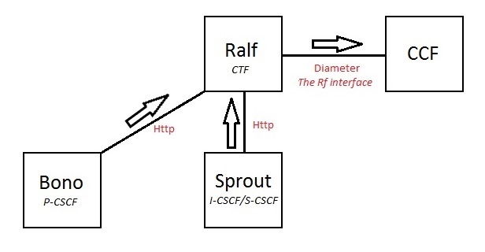

An IMS network has two mechanisms for generating billing records. These are known as Ro billing and Rf billing. Billing is obviously important for a service provider so that they can bill their subscribers appropriately. Ro billing is an online, pay as you go style billing system, whereas Rf billing is offline and the billing records are consolidated retrospectively. This post will focus on Rf billing.

So how does Rf billing work?

Traditionally each element in a network might be responsible for generating call detail records (CDRs) for billing. In Rf billing, this is done by a single node – the Charging Collection Function (CCF). Each element in the network that generates billing events has a Charging Trigger Function (CTF) that sends messages to the CCF. The CCF then produces CDRs from these messages. Some IMS elements generate standalone billing messages that the CCF can render into CDRs immediately. Other IMS elements generate a number of billing messages relating to a single billable session (e.g. a call) which the CCF has to aggregate before producing a CDR. This all means that separate CDRs are generated for each element in the network.

For example, the originating S-CSCF in a call will initiate a billing session with the CCF (via its CTF) on the 200 OK response to the initial INVITE. It will then continue to send billing information to the CCF every time there is a re-INVITE transaction in the call (for example, there may have been a media renegotiation which needs to be billed differently). Once the call ends, it will send another message to terminate the billing session, and the CCF will be able to produce an appropriate CDR.

Since each element in the IMS network generates separate billing events, the CCF ends up creating multiple CDRs (S-CSCF, I-CSCF, BGCF etc) for a single logical billing session (e.g. a call). A billing mediation device can correlate all of these CDRs using the IMS Charging Identifier (ICID) field. This is a string that is generally generated by the P-CSCF at the beginning of the call and passed around in the P-Charging-Vector header on subsequent SIP messages.

The interface between the CTF and the CCF is called the Rf interface, and it’s a Diameter interface. The billing messages that are sent on this interface are called Accounting-Requests (ACRs) and corresponding Accounting-Answers (ACAs). As well as containing billing information, the ACRs include several important fields. The Accounting-Record-Type field defines whether the ACR corresponds to a one off billing event, or whether it’s initiating, continuing or terminating a billing session – it is set to EVENT, START, INTERIM or STOP as appropriate. In the example above, the S-CSCF would set this field to START on the intial INVITE, INTERIM on any re-INVITEs and STOP on the BYE. The Accounting-Record-Number field is incremented between ACRs within a single billing session, and allows the CCF to ensure it receives the ACRs in the correct order and identify when it has missed one. The Node-Functionality field defines which IMS element has created the ACR – i.e. S-CSCF, I-CSCF etc. For more detailed information on the structure of these Diameter messages, see [RFC 6733](https://tools.ietf.org/html/rfc6733) and the IMS Rf billing specification [3GPP TS 32.299](http://www.3gpp.org/DynaReport/32299.htm).

The CTF is configured with a billing realm. At start of day the CTF does NAPTR/SRV resolution on this realm. This realm should resolve to one or more Diameter identities representing Diameter peers. The CTF creates connections with some number of these peers – typically it creates at least two connections to provide redundancy. These peers are not necessarily CCFs – Diameter routing allows the CTF to send an ACR to any Diameter peer within a realm, and it will be forwarded on to the correct destination. This correct destination is specified in the Destination-Host field on the ACR. Subscribers are configured in the HSS with the location of their CCFs, and these CCFs are added to SIP flows in the P-Charging-Function-Addresses header. The CTF pulls one of these CCFs out of the PCFA header to use as the Destination-Host on ACRs.

Clearwater has an open source component called [Ralf](https://github.com/Metaswitch/ralf) which acts as the CTF for Clearwater’s P-CSCF (Bono), I-CSCF, S-CSCF and BGCF (all Sprout). These components all send JSON containing billing information over an HTTP interface to Ralf, which turns them into Diameter messages and speaks Rf with the CCF. For more information on enabling Rf billing on your Clearwater system, see the [Clearwater installation instructions](http://clearwater.readthedocs.org/en/stable/Manual_Install/index.html).

**Specifcation References**

*   [RFC 6733 - Diameter Base Protocol](https://tools.ietf.org/html/rfc6733)
*   [TS 32.299 - Rf Billing](http://www.3gpp.org/DynaReport/32299.htm)
*   [TS 32.240 - IMS Charging Architecture](http://www.3gpp.org/DynaReport/32240.htm)
*   [TS 32.298 - CDF CDR format for IMS](http://www.3gpp.org/DynaReport/32298.htm)
*   [TS 32.297 - CGF CDR file format](http://www.3gpp.org/DynaReport/32297.htm)
