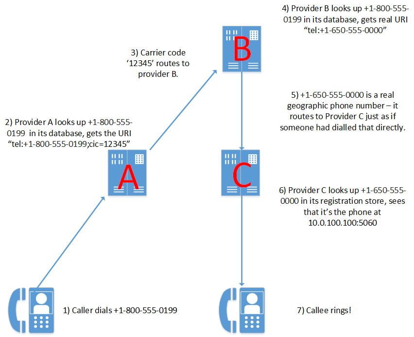

Routing non-geographic numbers with Clearwater
----------------------------------------------
There’s a lot more to Project Clearwater than first meets the eye. While a lot of users’ experience of us will be as a self-contained phone system for calls through VoIP softclients, just because that’s the easiest way to get started, we are a fully-featured IMS core, designed for and ready for use in real networks. (For example, [we’ve already handled end-to-end VoLTE calls in a joint project with Vip mobile](http://www.vipmobile.rs/about-vip/press-center.1091.html?itemId=517).) This means that we can’t just spend all our time working on cool next-gen features (although we still do a lot of that!) – we also have to think about how best to keep traditional phone services working as the world migrates to Clearwater. One of the things we’ve been thinking about recently is the routing of [non-geographic numbers](https://en.wikipedia.org/wiki/Non-geographic_telephone_numbers_in_the_United_Kingdom) (e.g. +1-800 numbers in the US or 0845 numbers in the UK). When talking about this, I’m going to refer to three service providers, Provider A, B and C.

*   Provider A is the calling-party service provider – one of their customers wants to dial +1-800-555-0199.
*   Provider B is the non-geographic number service provider. Ahead of time, somebody has bought +1-800-555-0199 from Provider B and said “please route this to +1-650-555-0000”.
*   Provider C is the called-party service provider – the one who actually owns +1-650-555-0000.

So what happens when you ring a non-geographic number like +1-800-555-0199? Well, the call flow will look like this diagram:

1.  It all starts when you ring +1-800-555-0199 on your phone.
2.  To handle that call, your service provider needs to find out who owns +1-800-555-0199 – specifically, it needs to find a carrier code identifying the owning service provider. It can do this through an ENUM query (looking it up over DNS – the modern, all-IP way to do this) or through an IM-SSF application server (for interop with the pre-IMS network).
3.  Once it’s done that, it gets the carrier code ‘12345’ – which identifies Provider B as the owner of +1-800-555-0199\. Provider A can then route to Provider B through whatever peering agreements it has – an MGCF routing over TDM trunks, or an IBCF routing over IP. (Most MGCFs and IBCFs – including Metaswitch’s own commercial products – allow you to route calls based on their carrier code.)
4.  The call then reaches Provider B – this is the provider who sold the +1-800-555-0199 number and owns it, so its job is to map that to the real geographic number and forward that on. It can do this however it likes, but ENUM and IM-SSF are the usual tools for looking up information about and doing conversions on phone numbers.
5.  After Provider B does that conversion, it has a real geographic number (+1-650-555-0000). At this point, everything proceeds as if +1-650-555-0000 had been dialled directly – Provider B has done the interesting work of converting the non-geographic number to a geographic one. It now works out who owns +1-650-555-000 (e.g. by knowing that Provider C owns the whole +1-650-555 area code) and routes the call there.
6.  Finally, the call reaches Provider C. This owns the number +1-650-555-0000 and knows which phone should receive those calls – so it just sends it there and…
7.  …the phone rings.

There are a couple of things to note about this flow:

*   +1-800-555-0199 is a toll-free number, but that doesn’t affect the routing – Provider A’s billing platform just spots that this is a toll-free number routed to Provider B, and bills it (or doesn’t bill it) appropriately. Likewise, Provider B’s billing platform will see that it is doing this toll-free number conversion and bills the end user.
*   Provider A and Provider B might be the same, or Provider B and Provider C might be the same, in reality (and indeed, Providers A and C could be the same). This just means that you skip some of the routing steps – e.g. if Provider A and B are the same, it can just convert +1-800-555-0199 to +1-650-555-0000 directly.

  Hopefully that gives you a good sense, not just of how non-geographic numbers work in IMS, but also how Clearwater can be integrated into a real system talking to the existing phone network. Leave comments below if you have any questions!
