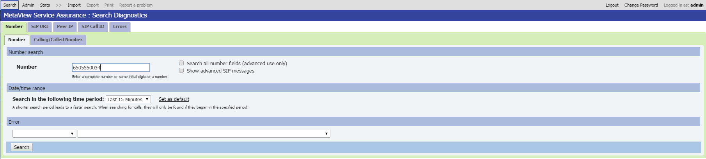
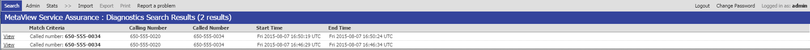
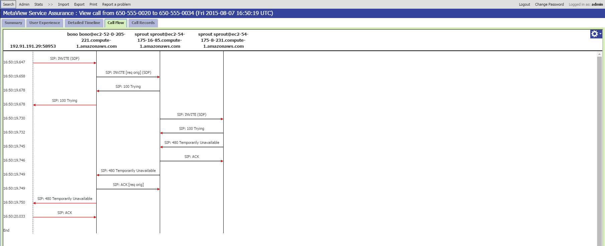
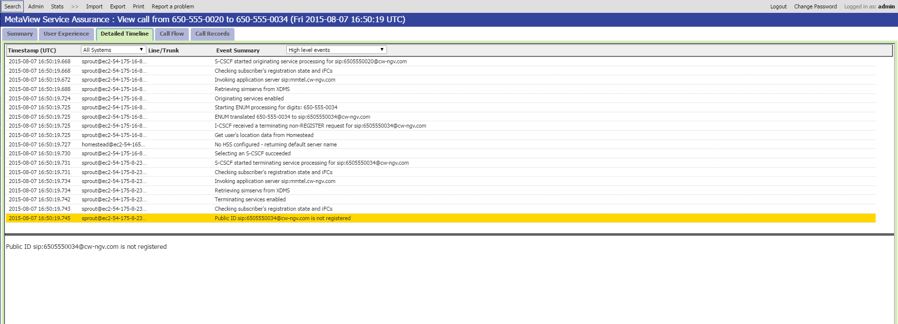

SAS - A Powerful Tool For Clearwater Problem Diagnosis
----------------------------------------------------------
If you’ve read Project Clearwater’s documentation or source code you may have seen references to SAS. SAS stands for the “Service Assurance Server” and is a product from [Metaswitch Networks](http://www.metaswitch.com/), the company that sponsors Project Clearwater. It allows service providers to easily diagnose a wide variety problems reported by their customers or operational staff; from simple problems like user error, through to interop problems, misconfigurations, network issues and even software faults. Traditionally, debugging these sorts of problems involves something like:

1.  Turn on additional diagnostics, such as network trace or debug logs, that you think will help diagnose the problem. However sometimes this isn’t possible – for example debug logging is often so resource intensive that it can’t be enabled on a production system.
2.  Re-produce the problem. Of course this assumes you know how to!
3.  Sift through the diagnostics to work out what is going wrong. This can be difficult if the diagnostics come from several different boxes, or if there are lots of other stuff going on at the same time that clutters up your traces or logs.

SAS takes a different approach. Instead of each node producing its own logs, all nodes log to a central SAS (or federation of SASs). It provides a web-based GUI to help you to search through the diagnostics and view the important information. It also draws a “call flow” which helps you pin down where in your network the problem is occurring. This approach has several advantages:

*   SAS logging is high enough performance that it can be switched on all the time. Also all diagnostic data is stored for 7 days. That’s right – all diagnostics information about all subscribers and all calls is retained for a week! This means there is usually no need to reproduce the problem to start diagnosing it.
*   SAS collects data from multiple boxes in the network. So instead of having to look at log files from several boxes you can view all the diagnostic information in one place.
*   SAS sorts through the diagnostics and only shows you the information you are interested in. For example if you are debugging a call failure, SAS will show you diagnostics for that call, but not for any others.
*   Data logged to SAS includes both call flow information and detailed information about the decisions each node is taking, including, crucially why that decision has been taken. This allows you to figure out not just what happened by why, which gives a big leg up in resolving the issue.

As an example suppose that Bob is one of your subscribers. He didn’t receive an important call from Alice. So Bob phones up your customer support line to complain. Bob owns telephone number 650-555-0034 so you start by searching for that number in SAS.

This gives a couple of results (Alice obviously tried to call again when she didn’t get through the first time).

If we open up one of the calls we can click on the “call flow” to see the protocol messages that were sent / received by various nodes. We can see it’s the terminating sprout that is rejecting Alice’s call.

The “detailed timeline” shows the events that occurred, the processing that different nodes did, and the decisions they made. This shows that Bob’s phone wasn’t registered.

This might be caused by something simple, like Bob’s softphone not running. But importantly SAS allowed us to track this problem down in just a few clicks! Hopefully this has shown you how useful SAS can be, and why we have lots of SAS logging scattered around our code. If you’d like more information on obtaining SAS, head over to [http://www.metaswitch.com/contact-us](http://www.metaswitch.com/contact-us) and get in touch.
