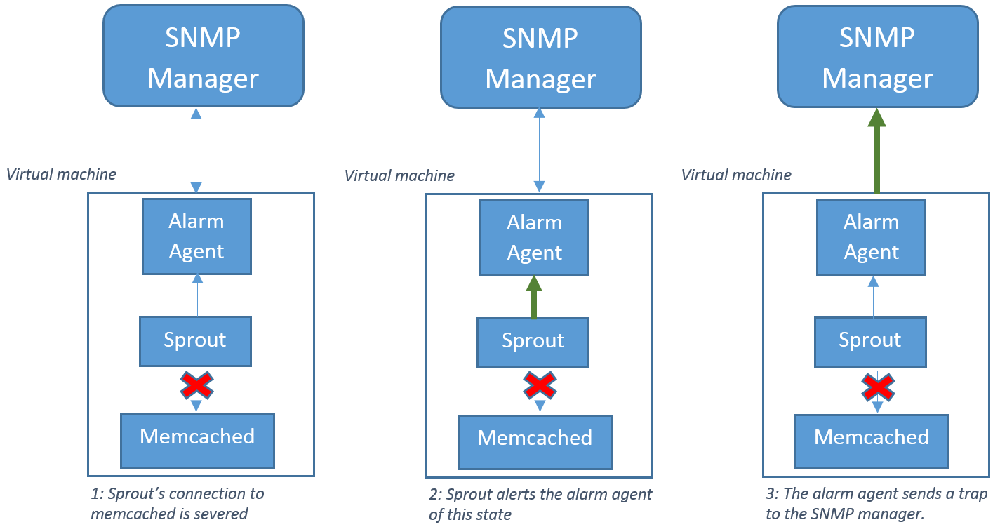
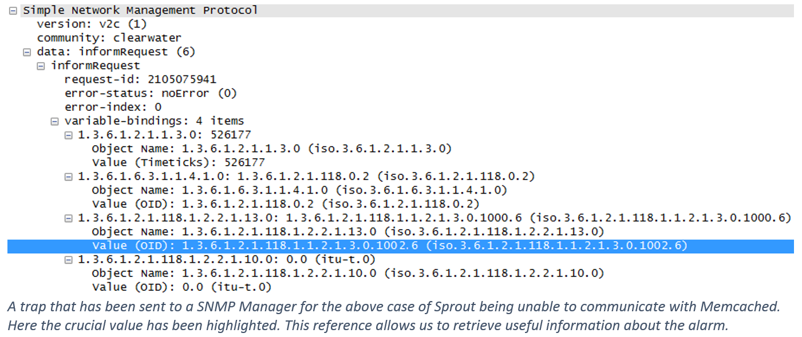

SNMP Alarm Agent
----------------
Internally Clearwater has a lot of moving parts, so with many processes interacting and depending on each other how can we be certain everything is behaving as it should? If, for example, a network error causes a process to lose contact with its data store we would like to be notified of this immediately to prevent data loss- just querying every process individually to find its behaviour would be inefficient and may not give us any useful information in time. SNMP allows Clearwater to report any unexpected behaviour immediately.

## SNMP Components

SNMP stands for “simple network management protocol” and is an industry standard tool for communicating information about devices across a network (for a general overview of SNMP see [here](https://www.youtube.com/watch?v=ZX-XGQoISHQ)). In Clearwater one of the ways we take advantage of this is having our virtual machines (VMs) use the protocol to report whenever it enters an error state. Each VM has an Alarm Agent available to it; whenever a process realises it is in an error state (by satisfying the conditions in any one of the pre-defined alarms) the process will alert the Alarm Agent which will then notify a configured external SNMP manager by sending a trap. The following diagram shows the process followed for a sample error – in this case the sprout and memcached connection goes down.

Clearwater also uses SNMP to send queries from the SNMP manager to all VMs which can be useful for intermittent polling (to help identify emerging trends and usage patterns for example). While a more detailed demonstration of this can be found in our blog posts on [Clearwater’s statistics](Statistics.md) and [Stateful Statistics](Stateful_Statistics.md) in this blog post I will look at how raised alarms trigger traps, what these traps consist of and how a network management system could take advantage of them.

## SNMP Traps

Clearwater uses traps to communicate that a process is in an abnormal state (or that the process has been cleared from this state and is now behaving as normal). Traps also contain other variables that can be used for diagnosis. Contained within the trap that the Alarm Agent sends to the SNMP Manager are four variable bindings that would allow a network management system (NMS) that interfaces with the SNMP Manager to retrieve useful information about the alarm raised and hence the state of a VM.

The four variable bindings contained within each trap message are:

*   sysUpTime: The time (in hundredths of seconds) since the SNMP Agent was started.
*   snmpTrapOID: Identifies whether an alarm is raising an error state or clearing one.
*   alarmActiveModelPointer: Allows a management system to retrieve useful information about the alarm (see below).
*   alarmActiveResourceId: The corresponding resource of the alarm. We don’t use alarm resources so this value is always 0.0.

## Alarm Model Table

Alarm Model Table (as defined in [RFC 3877](https://tools.ietf.org/html/rfc3877)) contains one row entry for each of the pre-defined alarms that may trigger a trap to be sent. Each one of these alarms has an index (to help identify it) and a state which indicates whether the process is in a critical error state (represented by ‘6’) or whether the process has returned to its normal expected behaviour (‘1’). Also included in this table is a brief description of the alarm suitable for display to operators, it is this value that is of most use for Clearwater diagnosis.

## ITU Alarm Table

In Clearwater we also make use of two more tables that are defined in [RFC 3877](https://tools.ietf.org/html/rfc3877). The International Telecommunications Union Alarm Table, referred to as the ITU Alarm Table, is a natural extension of the Alarm Model Table which contains more telecoms specific data. It is of use to Clearwater diagnostics as we can find additional details about each alarm including how to attempt to resolve its error state. For example if we were to manually query the ITU Alarm Table’s additional text field for the above alarm using the command:

    snmpget –m ./ITU-ALARM-MIB –c clearwater –v2c <host name> ITU-ALARM-MIB::ituAlarmAdditionalText.0.1002.critical_

we’d receive “Sprout is unable to contact any Memcacheds. It will periodically attempt to reconnect. If this alarm does not clear, ensure that at least one Memcached is operational and that network connectivity exists between it and Sprout.”

## Alarm Active Table

I’ve mentioned that a user of Clearwater could configure their existing NMS to query the Alarm Model Table to find details of an alarm after receiving a trap (how to do this will vary between NMSs) however when an NMS starts up how can we provide it with the current behaviour of the system? If an alarm was raised before an NMS started monitoring the network how would it know? This feature is provided by Alarm Active Table- a store of all the currently raised alarms. Each time an alarm is raised an entry is created for that instance within Alarm Active Table. If the instance of that alarm is later cleared the row is remove from the Alarm Active Table. For example if the following alarms were raised:

1.  1001.critical
2.  3500.critical
3.  1001.cleared
4.  5500.critical
5.  5500.cleared

The Alarm Active Table would contain one row for alarm 3500.critical. This row would contain details of exactly when the alarm was raised, a brief description of the alarm and the address of the relevant entry in Alarm Model Table for that alarm. If an NMS were to then start monitoring the network it would be able to query the Alarm Active Table to find that a VM is currently experiencing an error state. Note that because the row also contains an IP address of the VM that issued the alarm we could have a NMS listening to multiple VMs and able to pinpoint which are behaving as expected and which, if any, are in error states.

## Conclusion

While we don’t expect Clearwater to exhibit many errors, we’ve seen that when error states are raised or cleared a network manager is immediately alerted through use of a trap. As we use the MIBs contained within RFC3877 as a standard there is also no need to integrate specific traps for each vendor. Furthermore through the use of Alarm Model Table and ITU Alarm Table, detailed descriptions of each alarm can be found using the information contained within a trap. This method of alarm handling would require minimal pre-configuration of a NMS as any details required can be learned from the system at runtime. The Alarm Active Table allows a NMS to get up-to-speed with the current behaviour of the system whenever it starts-up or reboots. In light of these benefits we believe SNMP provides an efficient and immediate method of network diagnosis.
