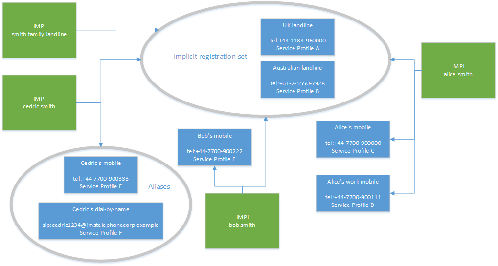

Secrets of the IMS Data Model - Introduction
--------------------------------------------
_This is the first post in a three-part series on the IMS data model – see [here](Secrets_2.md) and [here](Secrets_3.md) for the other entries._

One of the advantages of IMS is convergence - the idea that both fixed and mobile service (and software-based services like instant messaging) can be run off the same infrastructure, by the same companies, with a common user experience. This would mean that someone could ring my landline number and I could answer it on my mobile (or on my desktop). Sadly, the IMS specs for how this works are a bit piecemeal and quite technical, spread over five or six different documents and buried in subsections.

In this blog post (the first in a series), I'm going to try and pull the whole story together – what the IMS data model looks like overall and how it enables this convergence, by letting separate identities (mobile vs. landline, work vs. personal) map to the same device. In later blog posts, I’ll dive more into the technical details of the interfaces, covering how these groupings get communicated to all the IMS network elements.

## The Smith family

Before I dive into the details, I'm going to describe an example family: Alice Smith, Bob Smith and their child Cedric Smith. I'm going to give them a slightly complicated set of services and identities - this both shows what's possible in IMS, and means that when I'm later talking about particular terms like aliased public user identities, I can refer back to this as a real-world example and use-case. They have a contract with IMSTelephoneCorp which gives them the following:

*   a UK landline phone number (tel:+44-1134-960000)
*   an Australian landline phone number, to allow their Australian relatives to call them cheaply (tel:+61-2-5550-7928)
*   Alice's mobile (tel:+44-7700-900000)
*   Alice's mobile number for work (tel:+44-7700-900111)
*   Bob's mobile (tel:+44-7700-900222)
*   Cedric's mobile (tel:+44-7700-900333)
*   Cedric's online-only VoIP identity (sip:cedric1234@imstelephonecorp.example)

They have the following physical devices:

*   A landline, which is registered for the two landline numbers (connected in to the all-SIP IMS core network through an access gateway)
*   Alice's mobile phone which is also registered for the landline numbers, as well as Alice's personal mobile number and Alice's work mobile number (so she doesn’t have or need a separate work mobile)
*   Alice's work laptop which is registered for just Alice's work mobile number
*   Alice's personal laptop which is registered for the landline numbers and Alice's personal mobile number
*   Bob's mobile phone which is registered for the landline numbers and Bob's personal mobile number
*   Cedric's mobile phone which is registered for the landline numbers, Cedric's personal mobile number and Cedric's online-only VoIP identity

Obviously, there are some authorization requirements here - Cedric shouldn't be able to access Alice's work number, for example. To that end, they each have a private identity – e.g. alice.smith@imstelephonecorp.example, bob.smith@imstelephonecorp.example and cedric.smith@imstelephonecorp.example - each with separate authorization credentials (passwords, hardcoded credentials in SIM cards, etc.). There would also be a generic private identity (smith.family.landline@imstelephonecorp.example) used by the access gateway to authenticate the landlines. These identities would probably be grouped in the following ways:

*   Alice's two public identities are independent – so she can have her work number, and only her work number, on her work laptop.
*   Cedric's two public identities are aliases - he doesn't have to (and can't) manage them separately, or have one active but not the other
*   the UK and Australian landline phone numbers are implicitly registered together. However, they don't share the same services - let's say that the UK landline has voicemail, and the Australian landline doesn't (perhaps because it's an add-on service the Smiths haven't paid for).

## Concepts

At this point, we can draw a diagram of what the Smith family looks like to the IMS network. This introduces some concepts (such as aliasing and implicit registration sets) which I’ll explain throughout the rest of this post.

What I've described above as 'the Smith family' is a **subscription** in IMS terms. This can be thought of as the account with the service provider, grouping together more than one user - so a single person, a family, or a business would each have one subscription, although they have one, three or hundreds of users respectively. This is really a commercial or administrative grouping - it doesn't have much effect on call service. Within that subscription, there are one or more **public identities** (formally IP Multimedia Public Identities, or IMPUs). These are SIP or TEL URIs, like sip:Joe.Smith@provider.com or tel:+44-1134-960000\. These represent identities, not individuals - a person might have a single public identity that represents them (such as a mobile number), but they might have multiple identities (a personal and work mobile number), and identities might be shared across multiple people (a landline number shared by the whole family, or a helpdesk number shared by a team at work). The Smith family constitute a single subscription with six public identities. It's worth being clear that, in the IMS data model, nothing represents Alice, Bob or Cedric's existence as individuals - they only exist through their network identities. (In particular, given that Alice's personal mobile and her work mobile are separate identities, nothing in the IMS data model reflects the fact that both are Alice.) Although the IMS model does not identify the individual people associated with an IMPU or set of IMPUs, the IMS data model does specify **private identities** (formally IP Multimedia Private Identities, or IMPIs) - you can think of these as usernames. Authentication credentials (such as SIP Digest passwords or IMS AKA keys) are associated with private identities on a one-to-many basis, so a single private identity can have both Digest and AKA credentials. A mobile phone SIM card can store one private identity (but multiple public identities) - this is why I've assumed that Alice will have one private identity rather than separate ones for home and work, so that all her public identities can coexist on the same SIM. The last high-level concept I'd like to introduce are **service profiles**. These define which IMS services get invoked - for example, whether this is a consumer account which should trigger the application servers associated with the [Metaswitch VoWifi solution](http://www.metaswitch.com/voice-over-wifi-vowifi), or a business one that should trigger [Hosted PBX services](http://www.metaswitch.com/hosted-pbx). The specs are a little ambiguous, so there are two ways to think about service profiles:

*   you can think of them as global, with a handful of unique service profiles for the whole system, and individual public identities referencing those global profiles
*   you can think of them on a per-IMS-Subscription basis, with each IMS Subscription containing some service profiles (which may be identical to the ones in other IMS Subscriptions)

I'll be assuming the latter when I refer to them in this post (as this is how we generally think of them, and how we've implemented them in the Homestead provisioning API) - this makes quite a lot of sense, because when the HSS sends Push-Profile-Requests to update a service profile, that’s at the scope of an implicit registration set.

## Groupings and associations

Public and private identities can be associated together - this determines whether a particular private identity can authenticate the public identity when registering. Each public identity can be associated with just one private identity in the subscription, or with all of them - but those are the only options. (There are no such restrictions in the other direction - a private identity can authenticate a subset of public identities.) For example:

*   Alice's private identity authenticates all Alice’s public identities but not Bob’s or Cedric’s
*   Alice’s mobile phone number can only be authenticated by Alice’s private identity
*   The landline number can be authenticated by anyone’s private identity
*   It wouldn’t be possible to have a number that could be authenticated by Alice or Bob’s private identity, but not Cedric’s

There's more variety in how public identities can be associated with other public identities. Public identities can be linked in five ways (in increasing order of closeness): through being in the same subscription, through sharing a private identity, through being in the same implicit registration set, through sharing a service profile, and through being aliases. These are subsets of each other - that is, aliases must share a service profile, identities sharing a service profile must be implicitly registered together, identities implicitly registered together must share a private identity, and public identities sharing a private identity must be in the same subscription.

### Same IMS subscription

All identities in the same IMS subscription:

*   are assigned to the same S-CSCF
*   share the same charging information (e.g. primary CCF)

This reflects the fact that the IMS Subscription is an administrative/commercial grouping - for example, the Smith family will want to receive one unified bill, so sending all their billing records to the same CCF makes it easy to generate that bill.

### Sharing a private identity

Unlike the other means of association, this isn't transitive: looking at the example above, Alice's mobile and the landline share Alice's private identity, Bob's mobile and the landline share Bob's private identity, but Alice's and Bob's mobiles do not share a private identity. The main effect of sharing a private identity is that, as noted above, an ISIM has one private identity on it - public identities that share a private identity can be authenticated by the same ISIM.

### Implicit registration sets

If two or more public identities are in the same implicit registration set, then whenever one of them is registered at a particular contact address, all of them are considered to be registered there (without any further action needed - hence 'implicit' - or any way to register only some of these identities). All public identities in an implicit registration set must be associated with the same private identities (which is intuitive - if a private identity can register one of them, it must be able to register them all), but they don't need to share a service profile - they can invoke different application servers. For example, the Smiths' UK and Australian landlines are implicitly registered together, but calls to the UK landline might go to voicemail but the Australian landline not (if voicemail was an optional add-on extra).

### Sharing a service profile

If two or more public identities in the same implicit registration set also share a service profile, that's a new level of association. The main noticeable difference (apart from the obvious fact that they'll invoke the same services) is that when third-party registration is invoked and a REGISTER message is sent to an application server, only one REGISTER is sent for each service profile (picking an arbitrary identity from that service profile). (In the example of the Smith family, no lines are in this state. If they bought voicemail services for their Australian landline, their Australian and UK landlines would have the same service profile, but they wouldn't be aliases - they just happen to have the same services, rather than that being inherently true.)

### Aliases

If two public identities are aliased, then they don't just share the same service profile - they share the same service-specific data (also known as “transparent data”). For example, if two public identities just shared the same service profile, and that service profile included an MMTel app server, then it would be invoked for both public identities, but might be set up differently (e.g. different privacy settings). If the two identities are aliases, however, then their service configuration can't differ - calls to both lines would be treated identically. The fact that this service-specific “transparent data” can’t differ between aliases is actually enforced by the HSS, which stores it. When multiple identities are aliased, the HSS stores their “transparent data” as a group – all queries and updates read and write the same underlying data, so changes to the configuration of one alias automatically affect them all. This is true for Cedric’s two public identities - they're just different names, and it doesn't make sense for their call services to differ at all. Aliases also affect:

*   call diversion logic – if an app server receives a call targeted at Cedric and changes the request URI to one of Alice’s public identities, the core will spot that this is a diversion and apply Cedric’s originating call services (for example, checking it against call barring rules). If the request URI is changed to an alias of the original URI, though, the S-CSCF doesn’t treat it as a diversion, and this processing doesn’t need to happen.
*   the P-Asserted-Identity header – the S-CSCF will try and ensure that this header contains both a SIP URI and an aliased TEL URI, so that any network elements which interwork with the PSTN (e.g. an MGCF) can identify the subscriber by telephone number there.

## Other public identity types

Two things I haven't mentioned yet, in an attempt to keep things simple, are Wildcarded Public User Identities and Public Service Identities. Curious readers might be wondering how these fit in - luckily, they're not very complicated.

*   Wildcard Public User Identities are basically an optimization of implicit registration sets - they count as a group of public user identities which are implicitly registered together, and share a service profile (and must be implicitly registered alongside at least one non-wildcard public identity).
*   Public Service Identities can't register, so much of this infrastructure - particularly around implicit registration sets - simply doesn't apply to them.

## References/further reading

Interested readers may want to read the 3GPP specs on this themselves, whether to check the detail of a particular point, check my reasoning, or to find more information on related topics. In this section, I've tried to give a brief overview of what the relevant sections of each specs are, and where you should look for the definitive information on particular topics:

*   For the definition of 'subscriber' (in the "IMS Subscription") sense, look at TS 23.228 section 3.1 ("Definitions")
*   For the definition of Private User Identity, Public User Identity, Implicitly Registered Public User Identity Sets and Alias Public User Identity Sets, look at TS 23.008 section 3.1 ("Data related to subscription, identification and numbering")
*   Private User Identities and Public User Identities are also discussed by TS 23.003 sections 13.3 and 13.4 and TS 23.228 sections 4.3.3.1 and 4.3.3.2
*   For the definition of a Service Profile, see TS 23.228 section 4.3.3.4 and TS 29.228 appendix B.2
*   For a discussion of what pieces of data exist for a subscriber and their scope (e.g. the fact that charging function names are shared across the whole IMS subscription), see the whole of TS 23.008 section 3 ("Definition of data for IP Multimedia domain")
*   For diagrams showing the relationships between private/public identities, see TS 23.228 section 4.3.3.4
*   For the UE having only one private identity, see TS 23.228 section 4.3.3.1 (which is explicit about this for ISIMs) and TS 24.229 section 3.1 (specifically the definition of "Multiple registrations") which implies it for all UEs
*   For the existence of multiple credentials per private identity, see TS 29.228 table 6.3.2, where the S-CSCF sends both the User-Name and the SIP-Authentication-Scheme on a MAR request
*   For third-party registration towards application servers (including the fact that only one user identity per service profile is sent), see TS 24.229 section 5.4.1.7

I hope this has been a useful overview of how the IMS data model works, and how it can actually bring real benefits to users in managing their identities. If you have any questions or comments - and especially if you have any corrections - then please comment below or get in touch on the mailing list!
