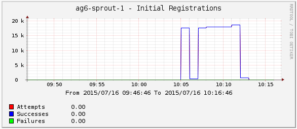

Clearwater's statistics
-----------------------
Over the summer, one of our main areas of focus has been Clearwater statistics – improving the quantity and the quality of the information users can get out of a running Clearwater system. In this blog post, I’m going to talk about:

*   the general picture of statistics in Clearwater
*   what new statistics we’ve added
*   the challenges of adding statistics to a distributed, stateless Clearwater system

# Introduction

Stats have always been important to Clearwater – they’ve been in Sprout since we first launched the open-source project in early 2013\. They’re vital for two reasons:

*   Clearwater is an elastically-scalable, NFV-ready IMS core, designed to be monitored and scaled by orchestrators – so orchestrators need to be able to detect sharp increases or sharp falls in load, in order to spin up new VMs
*   As an IMS core, Clearwater is an essential part of telecoms infrastructure – any failures or misconfigurations might lead, for example, to emergency calls failing. It’s therefore very important that you can monitor Clearwater systems – to have the metrics you need to spot and react to unusual patterns of failure.

We’ve therefore been gradually improving our stats function – adding more stats, improving their robustness, migrating from our original [ZeroMQ](https://en.wikipedia.org/wiki/%C3%98MQ)-published stats to a standards-compliant [SNMP](https://en.wikipedia.org/wiki/Simple_Network_Management_Protocol) interface – but this summer’s work represents one of the biggest steps forward in a while.

# New statistics

Our focus in the last few months has been on getting SIP statistics out of the core Sprout S-CSCF function (rather than some of the other, optional components), so that these stats will appeal to the widest range of our users. Examples include:

*   Counts of SIP authentication challenges and failures, to help spot DDoS attacks
*   SIP transaction counts for the I-CSCF, S-CSCF and BGCF – these will help detect odd spikes in load, or unusual patterns of failures (for example, if you configure your HSS with the wrong capabilities and your S-CSCF traffic drops to zero)
*   Counts of INVITE cancellations, and whether the CANCEL came before or after ringing – these help you tell whether people are hanging up because traffic is slow to pass through the core network, or whether the called parties are just being slow in getting to the phone
*   Counts of successful and failed third-party registrations, so you can see if one of our app servers starts rejecting REGISTER messages
*   The request rate Sprout will allow before starting overload processing (on which [we’ve previously written a more detailed blog post](Load_Monitor.md))

Despite focusing on S-CSCF SIP statistics, we have added stats in some other areas, too:

*   Our app servers now also report SIP transaction stats
*   Homestead reports requests sent to/received from the HSS over the Cx interface, along with the response codes received

# Using our statistics

You can learn about how to query SNMP stats on a running system [from our docs](http://clearwater.readthedocs.org/en/stable/Clearwater_SNMP_Statistics/index.html#usage), which include a full list of available statistics. We also document some suggestions on how to set up better visualisations of them, [like Cacti graphs](http://clearwater.readthedocs.org/en/stable/Cacti/index.html):

# Stateless vs. stateful statistics

As long-time Clearwater aficionados will know, the secret of Clearwater’s success is that it tries to be as stateless as possible – for example, being transaction-stateful rather than dialog-stateful (so if you start a call through a Sprout node and it’s scaled down, your call isn’t torn down). You can find out more about this approach at [architecture](../pages/Architecture.md). This makes it challenging to pull out stats that rely on longer-term state – counting the number of active registrations or calls, for example. We’ve taken a two-pronged approach here:

*   We’ve added a lot of statistics like the ones above, which rely only on transaction state – these fit well within Clearwater’s architecture, and still provide very useful metrics to our users.
*   We’ve also kicked off some broader infrastructure work to allow us to gather statistics based on long-term state (for calls and registrations). We’ll have another blog post describing this very shortly…stay tuned!

# Contributing

Do you have information you’d like to get out of Clearwater that isn’t covered above? If so, let us know on the mailing list or in the comments – or better yet, add the stat yourself! Adding new statistics is relatively easy, and a good way to get started contributing to Clearwater. For example, see [https://github.com/Metaswitch/sprout/pull/1154/files](https://github.com/Metaswitch/sprout/pull/1154/files), which added a new stat (requests where an AS had forced routing in a particular way) in about 20 lines of code (many of which were tests).
