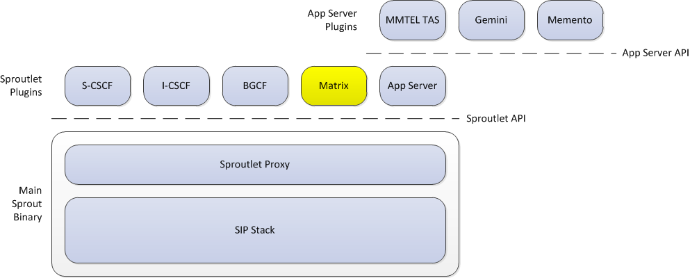

TADHack-mini London and Sproutlets
----------------------------------
Over the weekend of April 11-12, I attended [TADHack-mini](http://tadhack.com/2015/tadhack-mini-london/), held at [IDEALondon](http://www.idea-london.co.uk/). The theme was [WebRTC](http://www.webrtc.org/), and for my hack I built a [gateway](https://github.com/matt-williams/sprout/tree/matrix) between Project Clearwater (which speaks SIP) and [Matrix](http://matrix.org/), an open standard for decentralized communication (which supports VoIP calls using WebRTC). See my hack write-up over at the [TADHack blog](http://blog.tadhack.com/2015/04/18/clearwater-matrix-gateway/). In this blog post, I'm going to talk a bit about the Sproutlet API on which it's built. Sprout is Project Clearwater's SIP router component. It is built on top of the open-source [PJSIP](http://www.pjsip.org/) SIP stack and, as well as SIP, includes infrastructure to support other protocols such as HTTP, ENUM/DNS, Cassandra and Memcached. It exposes this infrastructure to Sproutlets, which encapsulate the "business logic" of S-CSCF, I-CSCF, BGCF and Project Clearwater's built-in ASs (MMTEL, [Gemini](https://github.com/Metaswitch/gemini/), [Memento](https://github.com/Metaswitch/memento), etc.)... and, after my hack, my Matrix Sproutlet plugin.

As shown in the diagram above, there is both a full Sproutlet API and an App Server API. The App Server API is effectively a simpler subset of the full Sproutlet API. It doesn't have quite the same flexibility but it is sufficient for the kind of things that most application servers need to do. Note that Clearwater also supports the standard ISC interface to external application servers. Sproutlets are dynamically loaded from "shared object" libraries - this allows new services to be added without having to rebuild Sprout itself. At start-up, all .so files in the /usr/share/clearwater/sprout/plugins directory are loaded, so installing a new Sproutlet is just a case of copying its shared object into place. When the Sproutlet plugin is loaded, it registers itself with the Sproutlet Proxy, specifying a filter of requests it's interested in, e.g. requests with a given SIP URI as their request URI or in their top Route header, or requests received on a specific port. So what does a Sproutlet actually look like? There are two basic classes.

*   The Sproutlet itself, which is offered every request matching the filter. It performs any further checks on whether it's interested in the request and, if so, constructs a SproutletTsx...
*   The SproutletTsx, which actually handles the transaction. A new SproutletTsx is created for each transaction, and lives for the duration of the transaction. The SproutletTsx is called back whenever anything happens on the transaction, e.g. the initial request is received, a new response is received, a timer pops or a CANCEL is received. The SproutletTsx base class on which we build provides standard methods for accessing and manipulating SIP requests, diverting or forking them, or replying to them.

Some Sproutlets have multiple SproutletTsxs, and the Sproutlet decides up-front (e.g. based on the method of the SIP request) which they're going to use for this transaction. A key feature of Project Clearwater is its stateless architecture, which results in massive scalability and simple, robust fault-tolerance. Sproutlets automatically benefit from this architecture. Dialogs are not tied to a specific Sprout instance, so the dialog-initiating transaction could be handled by one and a subsequent in-dialog transaction could be handled by another. If dialog statefulness is required, the infrastructure provides APIs that make it easy to store it in Sprout's distributed, fault-tolerant memcached cluster. As an example of how easy the Sproutlet architecture makes it to add new function, my Matrix Sproutlet was only about 1500 lines of code, and the vast majority of that was building and parsing the JSON objects used by the Matrix service itself! For more information on Sproutlets, see the [Sproutlet API definition](https://github.com/Metaswitch/sprout/blob/dev/include/sproutlet.h), the [App Server API definition](https://github.com/Metaswitch/sprout/blob/dev/include/sproutletappserver.h) or the [Gemini source code](https://github.com/Metaswitch/gemini/) for a simple example... and obviously ask on the [mailing list](http://lists.projectclearwater.org/listinfo/clearwater) if you have any questions!
