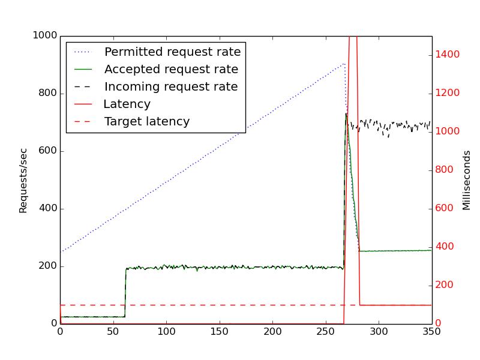
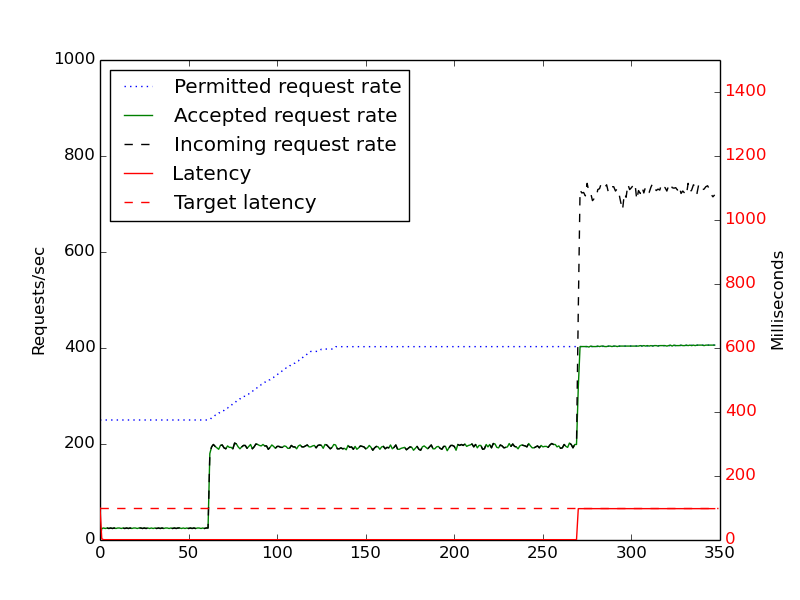

Tuning overload control for telco-grade performance
------------------------------------------------------------
Previously, [we’ve blogged about Project Clearwater’s load monitoring and throttling](Load_Monitor.md), and some advice for testing Project Clearwater, to stop unrealistic load patterns triggering our overload control. Over the last couple of years, as we’ve built up experience with this load control algorithm, we’ve made a few tweaks to it to improve its effectiveness.

## Diagnosability and over-reaction

One problem we saw was in the case where there was a latency spike in the network lasting a few milliseconds, but which still drove the average latency above our 100ms threshold, causing Clearwater to start rejecting calls with 503 Service Unavailable errors. This latency spike in the network was transient, and behaviour returned to normal after it finished. Still, this network latency meant that users got bursts of 503s, and these were difficult to diagnose. (Although Metaswitch Service Assurance Server lets you check these calls, and see a log confirming that they’ve been rejected due to overload, this wasn’t possible for community users who didn’t have SAS.) The failed calls also didn’t make intuitive sense – when users looked at the latency figures (which were averaged over 5 seconds), they just saw a normal latency (with these short bursts smoothed out), and didn’t see any degradation of service that would justify rejecting requests. Our solution here was to limit the frequency of changes to the rate limit – Clearwater’s permitted request rate now changes, at most, once every two seconds. This has two benefits:

*   It’s easier to create logs for this – for example, it’s possible to write a high-level log to /var/log/sprout about the rate change, without risking high disk IO.
*   It’s more reflective of reality – Clearwater only throttles load if there is a sustained degradation of service, rather than a brief blip in the network.

## Coping with quiet periods

Another issue we saw was with the following scenario:

*   The network enters a quiet period – with Clearwater receiving, say, a request every few seconds.
*   When load is so low across the system, Clearwater can respond very quickly – often in under a millisecond (where our standard latency target is 100ms). This is because our latency figures have an exponential distribution – they stay relatively low until the point where Clearwater’s receiving work faster than it can handle it, and the latency figures then shoot up rapidly.
*   After handling several of these requests, Clearwater sees that it’s well below the target latency, and increases the permitted request rate.

After a while, we might increase our permitted request rate to a level that’s unsustainable at load (because of the exponential distribution our load follows). When incoming requests then rise to that rate, our internal queues will fill up, and work will be heavily delayed until we reduce our permitted request rate again. The approach we’ve taken to resolve this is to say, effectively, “if Clearwater _could_ handle N requests/sec, but it’s only handling N/2 requests/sec or fewer, don’t increase rate”. To give a specific example, if our permitted request rate is 1,000 requests/second, then we need to be handling 500 requests/second or more to increase it – if we’ve only handled 499 or fewer, we’ll never increase our request rate, no matter how quickly we handled those requests. This means that we’ll still grow as normal if we’re hitting our current limit but still performing well, but prevents the situation where Clearwater’s permitted request rate is 1,000 requests/second, but it’s actually only processing 1 request/sec, but keeps increasing the rate anyway. Some graphs might illustrate the problem better:

In this graph, using the load monitor code without this change:

*   We injected 25 requests/sec for a minute, then 200 requests/sec for three more minutes. Because we were coping with this level of load, our permitted request rate kept growing.
*   After four minutes, the load stepped up to 750 requests/sec. This was more than this system was actually able to handle – but because the permitted request rate had grown to 900 requests/sec during the quiet period, all the requests got accepted, our internal queues clogged up, and latency shot up (off the chart - above 1500ms per request) until we started rejecting work.

Our second graph shows the effect of the change:

The permitted request rate stops rising after a certain point (because it can’t rise if we’re using less than 50% of the current rate), and consequently our internal queues never get clogged up, and latency doesn’t spike. (Note that the numbers here come from tests of just the load monitor code – this isn’t the number of requests/sec a Sprout node could process. We’d expect those graphs to have the same overall shape, but different numbers.)

## Upstream penalties

The IMS topologies that Project Clearwater is deployed in are a lot more complex than a lot of ordinary webservers, which in turn adds complexity to our overload system. Specifically, we might pass a request on to an external component (for example, a HSS) which might be overloaded. It might also have less sophisticated overload control than ours, so it might not be rejecting enough load to recover on its own – we should be throttling our load as well, to reduce the load on it and help it recover. We can’t spot this scenario just by tracking the latency of requests – the overload rejections from the external component may be very fast. In fact, this could skew our overload calculations – we could see that we were handling some requests very quickly, and increase our permitted request rate, overloading the external component even more. We’ve guarded against this by enhancing our overload control algorithm with a concept of “penalties”. Whenever we receive an overload response from an external resource, we apply a penalty. When we’re checking whether we should change our permitted request rate, if we’ve seen penalties, we always reduce our permitted request rate (behaving as though we had an above-threshold latency).

## Using our changes

Our load monitor is open-source and available at [https://github.com/Metaswitch/cpp-common/blob/master/src/load\_monitor.cpp](https://github.com/Metaswitch/cpp-common/blob/master/src/load_monitor.cpp), and it should be relatively easy to integrate into other GPLv3 C++ applications. The API is relatively simple – you should be able to work it out just from [the header file](https://github.com/Metaswitch/cpp-common/blob/50602200d135ec0e4d3c37887cf833fd276bf994/include/load_monitor.h#L70).
