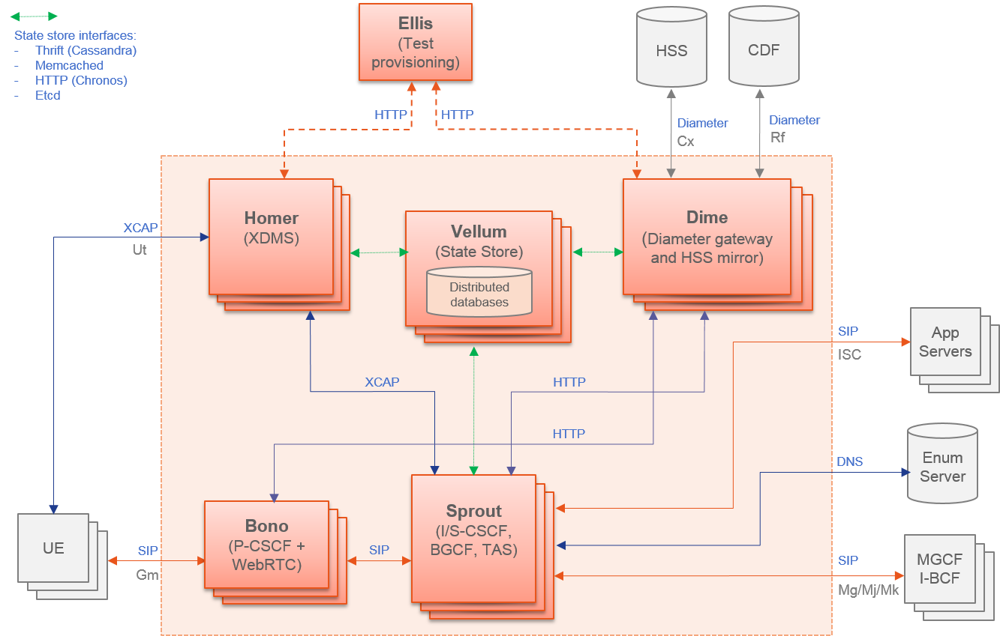

Updated Architecture
--------------------
Project Clearwater has been designed from the ground up to be optimized for deployment in virtualized and cloud environments, leaning heavily on established design patterns for building and deploying massively scalable web applications and adapting these design patterns to fit the constraints of SIP and IMS. A key part of that has always been the separation, at the component level, of processing functions and state-storage functions.

*   Core processing components such as Sprout have never stored any long-lived state. This avoids the need for these components to implement complex replication mechanisms and allows the processing functions to be scaled by quickly and easily spinning up (or tearing down) component instances.
*   All long-lived state is stored in dedicated storage services based on cloud-optimized storage technologies such as Cassandra and memcached.

We are now taking this to its logical conclusion and also separate processing and storage functions at the node level. Most significantly we are introducing a new storage node, “Vellum” which hosts all of the storage services:

*   **Cassandra**. Used by Homestead to store authentication credentials and profile information, by Memento to store call list information and by Homer to store MMTEL service settings.
*   **etcd**. Used by Vellum itself to share clustering information between Vellum nodes and by other nodes in the deployment for shared configuration.
*   **[Chronos](https://github.com/Metaswitch/chronos)**. Chronos is a distributed, redundant, reliable timer service developed by Clearwater. It is used by Sprout and Ralf nodes to enable timers to be run (e.g. for SIP registration expiry) without pinning operations to a specific node (one node can set the timer and another act on it when it pops).
*   **[Astaire](https://github.com/Metaswitch/astaire) + memcached**. Astaire is a service developed by Clearwater to front memcached clusters enabling more rapid scaling. This cluster is used by Sprout and Ralf for storing registration and session state.

At the same time, Homestead and Ralf become co-located on “Dime” nodes. The complete updated deployment architecture is shown below.

This new architecture delivers a number of benefits:

*   All nodes except for Vellum are entirely free of long-lived state as they no longer run any storage functions. This means that it is even quicker and easier to horizontally scale e.g. Sprout clusters to meet varying demands for SIP processing capacity. The nature of the services on these nodes make them ideal for running on low spec VMs with multiple VMs per host enabling more efficient VM packing and more granular scaling.
*   Vellum nodes (hosting the storage services) can also be scaled horizontally, but the services they run are also capable of scaling vertically to fully exploit large nodes with better processing and storage specifications. Deploying fewer but larger Vellum nodes may make it easier to ensure that only a single Vellum node runs on each physical host, further improving fault tolerance.

The new architecture will be supported from release-122 (“Ecthelion”) at which point all [documentation](http://clearwater.readthedocs.io/en/stable/index.html) will be updated accordingly. If you have an existing Clearwater deployment then we recommend that you redeploy using the new architecture and, from release-122, automated install using Chef will deploy using the new architecture by default.

*Vellum*: named after the material on which British laws and other important historic documents are traditionally printed due to its durability and long life span (~5000 years!)

*Dime*: reflecting its role as a “Diameter” gateway.
